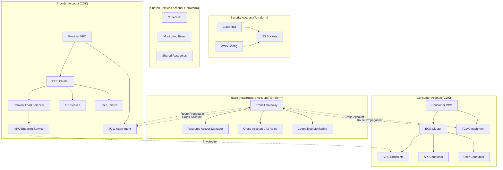

# Multi-Account Microservices with AWS ECS, PrivateLink, Terraform, and CDK

A secure, scalable multi-account microservices architecture using AWS ECS, PrivateLink, Terraform, and AWS CDK (TypeScript). Each account maintains its own complete infrastructure with cross-account connectivity via Transit Gateway.

## Table of Contents

- [Architecture](#architecture)
- [Project Structure](#project-structure)
- [Prerequisites](#prerequisites)
- [Quick Start](#quick-start)
- [Deployment](#deployment)
- [Configuration](#configuration)

## Architecture



### **Terraform (Base Infrastructure)**
- **Base Infrastructure Account**: Transit Gateway, cross-account IAM roles, centralized monitoring
- **Security Account**: CloudTrail, Config, S3 buckets, cross-account policies
- **Shared Services**: CodeBuild, monitoring roles, shared resources

### **CDK (Application Infrastructure)**
- **Provider Accounts**: Complete VPC infrastructure, ECS clusters, services, Network Load Balancers, VPC Endpoint Services, Transit Gateway attachments
- **Consumer Accounts**: Complete VPC infrastructure, ECS clusters, Interface VPC endpoints for consuming external services, Transit Gateway attachments

## Project Structure

```
├── terraform-base-infra/          # Core VPC and networking infrastructure
├── terraform-security-account/    # Security and compliance resources
├── terraform-shared-services-account/ # Shared services and CI/CD
├── cdk-provider-account/          # Service provider infrastructure
├── cdk-consumer-account/          # Service consumer infrastructure
└── microservice-repo/             # Sample FastAPI microservice
```

## Prerequisites

- **Terraform** (v1.0+)
- **Node.js** (v18+)
- **AWS CDK CLI** (`npm install -g aws-cdk`)
- **AWS CLI** configured with appropriate credentials
- **Docker** (for microservice development)

### AWS Profile Setup

Configure AWS profiles for each account. Both Terraform and CDK will automatically use these profiles:

#### AWS Credentials Configuration

**Quick Setup - Single Command:**

```bash
# Create AWS credentials file with all required profiles
cat > ~/.aws/credentials << 'EOF'
[default]
aws_access_key_id = YOUR_DEFAULT_ACCESS_KEY_ID
aws_secret_access_key = YOUR_DEFAULT_SECRET_ACCESS_KEY

[base-infra]
aws_access_key_id = YOUR_BASE_INFRA_ACCESS_KEY_ID
aws_secret_access_key = YOUR_BASE_INFRA_SECRET_ACCESS_KEY

[security-account]
aws_access_key_id = YOUR_SECURITY_ACCESS_KEY_ID
aws_secret_access_key = YOUR_SECURITY_SECRET_ACCESS_KEY

[shared-services-account]
aws_access_key_id = YOUR_SHARED_SERVICES_ACCESS_KEY_ID
aws_secret_access_key = YOUR_SHARED_SERVICES_SECRET_ACCESS_KEY

[provider-account]
aws_access_key_id = YOUR_PROVIDER_ACCESS_KEY_ID
aws_secret_access_key = YOUR_PROVIDER_SECRET_ACCESS_KEY

[consumer-account]
aws_access_key_id = YOUR_CONSUMER_ACCESS_KEY_ID
aws_secret_access_key = YOUR_CONSUMER_SECRET_ACCESS_KEY
EOF

# Create AWS config file
cat > ~/.aws/config << 'EOF'
[default]
region = us-east-1
output = json

[profile base-infra]
region = us-east-1
output = json

[profile security-account]
region = us-east-1
output = json

[profile shared-services-account]
region = us-east-1
output = json

[profile provider-account]
region = us-east-1
output = json

[profile consumer-account]
region = us-east-1
output = json
EOF
```

#### Security Best Practices

1. **Use IAM Roles**: Prefer IAM roles over access keys when possible
2. **Rotate Credentials**: Regularly rotate access keys
3. **Least Privilege**: Grant only necessary permissions
4. **Use AWS SSO**: For organizations, use AWS SSO for centralized access management
5. **Secure Storage**: Keep credentials secure and never commit them to version control
6. **Environment Variables**: For CI/CD, use environment variables instead of files

#### Hardcoded Profile Configuration

Both **Terraform** and **CDK** applications now have **hardcoded AWS profiles** to eliminate the need for environment variable exports:

**Terraform Provider Configuration:**

**Base Infrastructure** (`terraform-base-infra/provider.tf`):
```hcl
provider "aws" {
  region  = local.aws_region
  profile = "base-infra"  # Hardcoded profile for base infrastructure
  # ... other configuration
}
```

**Security Account** (`terraform-security-account/provider.tf`):
```hcl
provider "aws" {
  region  = local.aws_region
  profile = "security-account"  # Hardcoded profile for security account
  # ... other configuration
}
```

**Shared Services Account** (`terraform-shared-services-account/provider.tf`):
```hcl
provider "aws" {
  region  = local.aws_region
  profile = "shared-services-account"  # Hardcoded profile for shared services account
  # ... other configuration
}
```

**CDK Applications:**

**Provider Account** (`cdk-provider-account/bin/app.ts`):
```typescript
// Set AWS profile for this CDK app
process.env.AWS_PROFILE = 'provider-account'; // Replace with your actual profile name
```

**Consumer Account** (`cdk-consumer-account/bin/app.ts`):
```typescript
// Set AWS profile for this CDK app
process.env.AWS_PROFILE = 'consumer-account'; // Replace with your actual profile name
```

**CDK Context Configuration** (`cdk.json`):
```json
{
  "context": {
    "aws-profile": "provider-account",  // or "consumer-account"
    // ... other context
  }
}
```

#### Benefits of Hardcoded Profiles

- **No exports needed**: Run `terraform apply` and `cdk deploy` directly without `export AWS_PROFILE=...`
- **Account isolation**: Each Terraform module and CDK app automatically uses its designated profile
- **Override capability**: Still can override with `--profile` flag if needed
- **Clean deployment**: Simplified CI/CD and local development workflows

#### Usage Examples

**Terraform:**
```bash
# Base infrastructure - no export needed
cd terraform-base-infra
terraform apply  # Automatically uses 'base-infra' profile

# Security account - no export needed
cd ../terraform-security-account
terraform apply  # Automatically uses 'security-account' profile

# Override if needed
terraform apply -var="profile=different-profile"
```

**CDK:**
```bash
# Provider account - no export needed
cd cdk-provider-account
cdk deploy  # Automatically uses 'provider-account' profile

# Consumer account - no export needed  
cd cdk-consumer-account
cdk deploy  # Automatically uses 'consumer-account' profile

# Override if needed
cdk deploy --profile different-profile
```

#### Testing Your AWS Profiles

After setting up the profiles, test them to ensure they're working correctly:

```bash
# List all configured profiles
aws configure list-profiles

# Test Terraform with profiles
cd terraform-base-infra
terraform plan  # Should use base-infra profile automatically

# Test CDK with profiles
cd cdk-provider-account
npx cdk synth  # Should use provider-account profile automatically
```

### GitHub Actions Setup

For automated CI/CD, configure the following secrets in your GitHub repository:

**Required Secrets:**
- `AWS_ACCESS_KEY_ID` - AWS access key for shared services account
- `AWS_SECRET_ACCESS_KEY` - AWS secret key for shared services account
- `BASE_INFRA_AWS_ACCESS_KEY_ID` - AWS access key for base infrastructure account
- `BASE_INFRA_AWS_SECRET_ACCESS_KEY` - AWS secret key for base infrastructure account
- `SHARED_SERVICES_AWS_ACCESS_KEY_ID` - AWS access key for shared services account
- `SHARED_SERVICES_AWS_SECRET_ACCESS_KEY` - AWS secret key for shared services account
- `PROVIDER_AWS_ACCESS_KEY_ID` - AWS access key for provider account
- `PROVIDER_AWS_SECRET_ACCESS_KEY` - AWS secret key for provider account
- `CONSUMER_AWS_ACCESS_KEY_ID` - AWS access key for consumer account
- `CONSUMER_AWS_SECRET_ACCESS_KEY` - AWS secret key for consumer account

**GitHub Actions Workflow:**
The repository includes a GitHub Actions workflow (`.github/workflows/build-and-deploy.yml`) that:
1. **Builds and pushes** the microservice Docker image to GitHub Container Registry (ghcr.io) on every push
2. **Deploys to Development** automatically on push to `main` branch
3. **Deploys to Staging/Production** with manual approval gates (GitHub Environments)
4. **Uses matrix strategy** to deploy to provider and consumer accounts in parallel
5. **Container Registry**: `ghcr.io/johnnymarquezv/aws-ecs-privatelink-terraform-cdk/microservice`

```bash
# Configure AWS profiles
aws configure --profile base-infra
aws configure --profile security-account
aws configure --profile shared-services-account
aws configure --profile provider-account
aws configure --profile consumer-account

# Or use AWS SSO
aws configure sso --profile base-infra
aws configure sso --profile security-account
aws configure sso --profile shared-services-account
aws configure sso --profile provider-account
aws configure sso --profile consumer-account
```

**Verify Profile Configuration:**
```bash
# Test each profile
aws sts get-caller-identity --profile base-infra
aws sts get-caller-identity --profile security-account
aws sts get-caller-identity --profile shared-services-account
aws sts get-caller-identity --profile provider-account
aws sts get-caller-identity --profile consumer-account
```

## Quick Start

### 1. Local Testing

**Verify Profile Configuration:**
```bash
# Test that profiles are working
aws sts get-caller-identity --profile base-infra
aws sts get-caller-identity --profile provider-account
aws sts get-caller-identity --profile consumer-account
```

**Test Terraform with Profiles:**
```bash
# Test different environments with profiles
cd terraform-base-infra
terraform workspace select dev && terraform plan
terraform workspace select staging && terraform plan
terraform workspace select prod && terraform plan
```

**Test CDK with Profiles:**
```bash
# Test CDK synthesis with profiles (no export needed - profiles are hardcoded)
cd cdk-provider-account
npx cdk synth

cd ../cdk-consumer-account
npx cdk synth
```

### 2. Deploy Infrastructure

The microservice is automatically built and pushed to GitHub Container Registry (ghcr.io) via GitHub Actions when changes are made to the `microservice-repo/` directory.

Deploy the infrastructure in the following order:

#### Step 1: Deploy Base Infrastructure
```bash
cd terraform-base-infra
terraform workspace select dev
terraform init
terraform apply
```

#### Step 2: Deploy Security Account
```bash
cd ../terraform-security-account
terraform workspace select dev
terraform init
terraform apply
```

#### Step 3: Deploy Shared Services Account
```bash
cd ../terraform-shared-services-account
terraform workspace select dev
terraform init
terraform apply
```

#### Step 4: Deploy Provider Account (CDK)

Deploy using hardcoded AWS profiles (no export needed):

```bash
cd ../cdk-provider-account
npm install

# 1. Bootstrap CDK (one-time setup per account/region)
npx cdk bootstrap

# 2. List available stacks
npx cdk ls

# 3. Deploy specific stacks (example: deploy dev environment)
npx cdk deploy api-service-dev-provider-stack user-service-dev-provider-stack
```

#### Step 5: Deploy Consumer Account (CDK)

Deploy using hardcoded AWS profiles (no export needed):

```bash
cd ../cdk-consumer-account
npm install

# 1. Bootstrap CDK (one-time setup per account/region)
npx cdk bootstrap

# 2. List available stacks
npx cdk ls

# 3. Deploy specific stacks (example: deploy dev environment)
npx cdk deploy api-consumer-dev-consumer-stack user-consumer-dev-consumer-stack
```

### 4. Test Connectivity

After deployment, test the cross-account connectivity:

#### Check ECS Services
```bash
# Check provider service status
aws ecs describe-services --cluster api-service-dev-cluster --services api-service-dev-service --profile provider-account

# Check consumer service status
aws ecs describe-services --cluster api-consumer-dev-cluster --services api-consumer-dev-service --profile consumer-account
```

#### Test Service Health
```bash
# Get provider service endpoint
PROVIDER_IP=$(aws ecs list-tasks --cluster api-service-dev-cluster --service-name api-service-dev-service --profile provider-account --query 'taskArns[0]' --output text | xargs -I {} aws ecs describe-tasks --cluster api-service-dev-cluster --tasks {} --profile provider-account --query 'tasks[0].attachments[0].details[?name==`privateIPv4Address`].value' --output text)

# Test provider health
curl -f http://$PROVIDER_IP:8080/health

# Get consumer service endpoint
CONSUMER_IP=$(aws ecs list-tasks --cluster api-consumer-dev-cluster --service-name api-consumer-dev-service --profile consumer-account --query 'taskArns[0]' --output text | xargs -I {} aws ecs describe-tasks --cluster api-consumer-dev-cluster --tasks {} --profile consumer-account --query 'tasks[0].attachments[0].details[?name==`privateIPv4Address`].value' --output text)

# Test consumer health
curl -f http://$CONSUMER_IP:80/health
```

#### Test Cross-Account Communication
```bash
# Test service discovery
curl http://$CONSUMER_IP:80/services

# Test service-to-service call
curl -X POST http://$CONSUMER_IP:80/call/api-service -H "Content-Type: application/json" -d '{}'
```

#### Check VPC Endpoint Service
```bash
# List VPC Endpoint Services
aws ec2 describe-vpc-endpoint-services --profile provider-account --filters "Name=service-name,Values=com.amazonaws.vpce.us-east-1.*"

# Check VPC Endpoint connections
aws ec2 describe-vpc-endpoint-connections --profile provider-account
```

## Deployment

### Terraform Backend Configuration

For production, configure S3 backend with DynamoDB locking:

```bash
# Create S3 bucket and DynamoDB table
aws s3 mb s3://your-terraform-state-bucket
aws dynamodb create-table --table-name terraform-locks --attribute-definitions AttributeName=LockID,AttributeType=S --key-schema AttributeName=LockID,KeyType=HASH --provisioned-throughput ReadCapacityUnits=5,WriteCapacityUnits=5
```

Update `provider.tf` in each Terraform directory:

```hcl
terraform {
  backend "s3" {
    bucket         = "your-terraform-state-bucket"
    key            = "terraform.tfstate"
    region         = "us-east-1"
    dynamodb_table = "terraform-locks"
    encrypt        = true
  }
}
```

### Deployment Order

1. **Base Infrastructure** (`terraform-base-infra`)
2. **Security Account** (`terraform-security-account`)
3. **Shared Services** (`terraform-shared-services-account`)
4. **Provider CDK** (`cdk-provider-account`)
5. **Consumer CDK** (`cdk-consumer-account`)

## Configuration

### Terraform Configuration

Each Terraform module uses `locals` blocks for configuration:

```hcl
locals {
  environment = terraform.workspace
  account_id  = "111111111111"
  
  environment_config = {
    dev = {
      memory_limit_mib = 512
      cpu              = 256
      desired_count    = 1
    }
    staging = {
      memory_limit_mib = 1024
      cpu              = 512
      desired_count    = 2
    }
    prod = {
      memory_limit_mib = 2048
      cpu              = 1024
      desired_count    = 3
    }
  }
}
```

### CDK Configuration

The CDK apps use a flexible configuration system in `lib/config.ts`:

```typescript
// Account configurations - can be overridden
export const ACCOUNTS = {
  provider: {
    accountId: process.env.AWS_ACCOUNT_ID || '222222222222',
    region: process.env.AWS_REGION || 'us-east-1',
    profile: process.env.AWS_PROFILE
  },
  consumer: {
    accountId: process.env.CONSUMER_ACCOUNT_ID || '333333333333',
    region: process.env.AWS_REGION || 'us-east-1',
    profile: process.env.CONSUMER_AWS_PROFILE
  }
};

// Service configurations
export const SERVICES = {
  'api-service': {
    name: 'api-service',
    port: 8080,
    image: 'microservice',
    description: 'API Service Provider'
  }
};

// Environment configurations
export const ENVIRONMENTS = {
  dev: {
    memoryLimitMiB: 512,
    cpu: 256,
    desiredCount: 1,
    vpcCidr: '10.1.0.0/16'
  }
};
```

### Environment Variables

For production deployment, update account IDs and region in the configuration files.

## Microservice Development

### FastAPI Microservice

The `microservice-repo/` contains a production-ready FastAPI application that serves as both provider and consumer services.

#### Local Development
```bash
cd microservice-repo
python -m venv venv
source venv/bin/activate  # On Windows: venv\Scripts\activate
pip install -r requirements.txt
uvicorn app.main:app --reload --host 0.0.0.0 --port 8000
```

#### API Endpoints

The microservice provides the following endpoints:

- `GET /` - Service information and status
- `GET /health` - Health check endpoint
- `GET /ready` - Readiness check with dependency validation
- `GET /services` - List discovered consumer services
- `POST /call/{service_name}` - Call another microservice
- `GET /status` - Detailed service status and metrics
- `GET /metrics` - Prometheus-compatible metrics

#### Environment Variables

The microservice is configured via environment variables:

```bash
SERVICE_NAME=microservice          # Service identifier
SERVICE_PORT=8000                  # Port to listen on
SERVICE_VERSION=1.0.0              # Service version
LOG_LEVEL=INFO                     # Logging level
ENABLE_METRICS=true                # Enable metrics endpoint
RATE_LIMIT=100                     # Requests per minute per IP
CONSUMER_SERVICES=[...]            # JSON array of consumer services
```

#### Docker Build

```bash
cd microservice-repo
docker build -t microservice:latest .
docker run -p 8000:8000 microservice:latest
```

#### Testing the Microservice

```bash
# Health check
curl http://localhost:8000/health

# Service information
curl http://localhost:8000/

# Service status
curl http://localhost:8000/status

# Metrics
curl http://localhost:8000/metrics
```

### Microservice Features

- **FastAPI Framework**: Modern, fast web framework with automatic API documentation
- **Health Checks**: Built-in health and readiness endpoints for ECS and load balancers
- **Service Discovery**: Dynamic service discovery and communication
- **Metrics**: Prometheus-compatible metrics for monitoring
- **Rate Limiting**: Built-in rate limiting middleware
- **Structured Logging**: JSON-formatted logs for CloudWatch
- **Security**: Non-root user, minimal base image, input validation
- **Cross-Service Communication**: HTTP-based service-to-service calls
- **Error Handling**: Comprehensive error handling and HTTP status codes

## Monitoring and Observability

### CloudWatch Logs

Monitor application logs in CloudWatch:

```bash
# Provider service logs
aws logs describe-log-groups --log-group-name-prefix "/dev/api-service" --profile provider-account

# Consumer service logs
aws logs describe-log-groups --log-group-name-prefix "/dev/api-consumer" --profile consumer-account

# View recent logs
aws logs tail /dev/api-service/ecs-application-logs --follow --profile provider-account
```

### ECS Service Monitoring

```bash
# Check service status
aws ecs describe-services --cluster api-service-dev-cluster --services api-service-dev-service --profile provider-account

# Check task health
aws ecs describe-tasks --cluster api-service-dev-cluster --tasks $(aws ecs list-tasks --cluster api-service-dev-cluster --service-name api-service-dev-service --profile provider-account --query 'taskArns[0]' --output text) --profile provider-account

# View service events
aws ecs describe-services --cluster api-service-dev-cluster --services api-service-dev-service --profile provider-account --query 'services[0].events'
```

### VPC Endpoint Service Monitoring

```bash
# Check VPC Endpoint Service status
aws ec2 describe-vpc-endpoint-services --profile provider-account --filters "Name=service-name,Values=com.amazonaws.vpce.us-east-1.*"

# Check VPC Endpoint connections
aws ec2 describe-vpc-endpoint-connections --profile provider-account

# Check Transit Gateway attachments
aws ec2 describe-transit-gateway-attachments --profile provider-account
```

## Troubleshooting

### Common Issues

#### 1. ECS Service Not Starting

**Symptoms**: Service shows as "PENDING" or tasks keep stopping

**Debug Steps**:
```bash
# Check task definition
aws ecs describe-task-definition --task-definition api-service-dev-task-definition --profile provider-account

# Check task logs
aws logs get-log-events --log-group-name /dev/api-service/ecs-application-logs --log-stream-name $(aws logs describe-log-streams --log-group-name /dev/api-service/ecs-application-logs --order-by LastEventTime --descending --max-items 1 --profile provider-account --query 'logStreams[0].logStreamName' --output text) --profile provider-account

# Check ECS service events
aws ecs describe-services --cluster api-service-dev-cluster --services api-service-dev-service --profile provider-account --query 'services[0].events'
```

**Common Causes**:
- Invalid ECR image URI
- Missing IAM permissions
- Health check failures
- Resource constraints

#### 2. Cross-Account Communication Failing

**Symptoms**: Consumer cannot reach provider service

**Debug Steps**:
```bash
# Check VPC Endpoint Service acceptance
aws ec2 describe-vpc-endpoint-connections --profile provider-account --filters "Name=vpc-endpoint-state,Values=pending-acceptance"

# Check Transit Gateway route propagation
aws ec2 describe-transit-gateway-route-tables --profile provider-account
aws ec2 search-transit-gateway-routes --transit-gateway-route-table-id tgw-rtb-xxx --filters "Name=route-search.exact-match,Values=10.11.0.0/16" --profile provider-account

# Check security group rules
aws ec2 describe-security-groups --group-ids $(aws ec2 describe-security-groups --filters "Name=group-name,Values=*api-service*" --profile provider-account --query 'SecurityGroups[0].GroupId' --output text) --profile provider-account
```

**Common Causes**:
- VPC Endpoint Service not accepted
- Transit Gateway routes not propagated
- Security group rules blocking traffic
- Network ACL restrictions

#### 3. ECR Image Pull Errors

**Symptoms**: ECS tasks fail with "CannotPullContainerError"

**Debug Steps**:
```bash
# Check ECR repository exists
aws ecr describe-repositories --repository-names microservice-dev --profile shared-services-account

# Check ECS task execution role permissions
aws iam get-role --role-name ecsTaskExecutionRole --profile provider-account

# Check ECR login
aws ecr get-login-password --region us-east-1 --profile shared-services-account | docker login --username AWS --password-stdin 111111111111.dkr.ecr.us-east-1.amazonaws.com
```

**Common Causes**:
- ECR repository doesn't exist
- ECS task execution role lacks ECR permissions
- Image doesn't exist in ECR
- Cross-account ECR access not configured

#### 4. Health Check Failures

**Symptoms**: ECS tasks keep restarting due to health check failures

**Debug Steps**:
```bash
# Test health endpoint directly
curl -f http://$SERVICE_IP:8080/health

# Check load balancer target health
aws elbv2 describe-target-health --target-group-arn $(aws elbv2 describe-target-groups --names api-service-dev-target-group --profile provider-account --query 'TargetGroups[0].TargetGroupArn' --output text) --profile provider-account

# Check ECS service health check configuration
aws ecs describe-services --cluster api-service-dev-cluster --services api-service-dev-service --profile provider-account --query 'services[0].healthCheckGracePeriodSeconds'
```

**Common Causes**:
- Application not listening on correct port
- Health check path incorrect
- Application startup time exceeds health check grace period
- Network connectivity issues

### Debug Commands

#### Get Service Endpoints
```bash
# Get provider service IP
aws ecs list-tasks --cluster api-service-dev-cluster --service-name api-service-dev-service --profile provider-account --query 'taskArns[0]' --output text | xargs -I {} aws ecs describe-tasks --cluster api-service-dev-cluster --tasks {} --profile provider-account --query 'tasks[0].attachments[0].details[?name==`privateIPv4Address`].value' --output text

# Get consumer service IP
aws ecs list-tasks --cluster api-consumer-dev-cluster --service-name api-consumer-dev-service --profile consumer-account --query 'taskArns[0]' --output text | xargs -I {} aws ecs describe-tasks --cluster api-consumer-dev-cluster --tasks {} --profile consumer-account --query 'tasks[0].attachments[0].details[?name==`privateIPv4Address`].value' --output text
```

#### Test Network Connectivity
```bash
# Test from consumer to provider (replace IPs with actual values)
aws ec2-instance-connect send-ssh-public-key --instance-id $CONSUMER_INSTANCE_ID --availability-zone us-east-1a --instance-os-user ec2-user --ssh-public-key file://~/.ssh/id_rsa.pub --profile consumer-account

# SSH to consumer instance and test connectivity
ssh ec2-user@$CONSUMER_IP "curl -f http://$PROVIDER_IP:8080/health"
```

## Security Considerations

- **Network Isolation**: Services communicate through VPC endpoints only
- **IAM Roles**: Least privilege access with cross-account role assumptions
- **Encryption**: All data encrypted in transit and at rest
- **Monitoring**: CloudTrail, Config, and CloudWatch for comprehensive logging
- **Container Security**: Non-root user, minimal base image, image scanning
- **VPC Endpoint Security**: Explicit acceptance required for connections
- **Transit Gateway**: Network ACLs and security groups apply to cross-account traffic

## Resources

- [AWS ECS Documentation](https://docs.aws.amazon.com/ecs/)
- [AWS PrivateLink Documentation](https://docs.aws.amazon.com/vpc/latest/privatelink/)
- [AWS Transit Gateway Documentation](https://docs.aws.amazon.com/vpc/latest/tgw/)
- [Terraform AWS Provider](https://registry.terraform.io/providers/hashicorp/aws/latest)
- [AWS CDK Documentation](https://docs.aws.amazon.com/cdk/)
- [FastAPI Documentation](https://fastapi.tiangolo.com/)
- [Docker Documentation](https://docs.docker.com/)