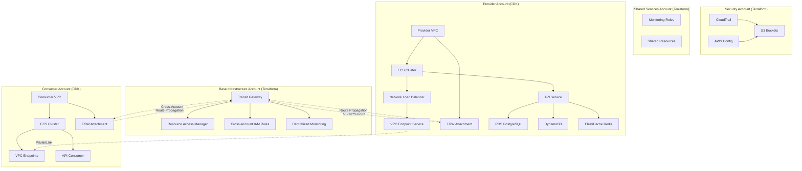

# Multi-Account Microservices with AWS ECS, PrivateLink, Terraform, and CDK

A secure, scalable multi-account microservices architecture using AWS ECS, PrivateLink, Terraform, and AWS CDK (TypeScript). Each account maintains its own complete infrastructure with cross-account connectivity via Transit Gateway.

## Table of Contents

- [Architecture](#architecture)
- [Project Structure](#project-structure)
- [Prerequisites](#prerequisites)
- [Quick Start](#quick-start)
- [Deployment](#deployment)
- [Configuration](#configuration)
- [Microservice Development](#microservice-development)
- [Monitoring](#monitoring)
- [Troubleshooting](#troubleshooting)

## Architecture



### Infrastructure Components

**Terraform (Base Infrastructure)**
- **Base Infrastructure Account**: Transit Gateway, cross-account IAM roles, centralized monitoring
- **Security Account**: CloudTrail, Config, S3 buckets, cross-account policies
- **Shared Services**: ECR repository, S3 artifacts bucket, monitoring roles, shared resources

**CDK (Application Infrastructure)**
- **Provider Accounts**: Complete VPC infrastructure, ECS clusters, services, Network Load Balancers, VPC Endpoint Services, Transit Gateway attachments, database infrastructure (RDS PostgreSQL, DynamoDB, ElastiCache Redis)
- **Consumer Accounts**: Complete VPC infrastructure, ECS clusters, Interface VPC endpoints for consuming external services, Transit Gateway attachments

### Database Architecture

The microservice architecture includes a comprehensive multi-database setup designed for high availability, performance, and scalability:

#### **PostgreSQL (RDS Aurora)**
- **Purpose**: Primary relational database for structured data (users, API requests, application data)
- **Engine**: Aurora PostgreSQL 15.4 with multi-AZ deployment
- **Features**: 
  - Automated backups with point-in-time recovery
  - Performance Insights for query optimization
  - Encryption at rest and in transit
  - Connection pooling for efficient resource utilization
- **Environment Configuration**:
  - **Dev**: t3.medium, 7-day backup retention
  - **Staging**: t3.large, 14-day backup retention, multi-AZ
  - **Prod**: r5.large, 30-day backup retention, multi-AZ, deletion protection

#### **DynamoDB**
- **Purpose**: NoSQL database for session management and user activity tracking
- **Features**:
  - Pay-per-request billing model
  - Global Secondary Index for efficient user activity queries
  - Point-in-time recovery enabled
  - TTL (Time To Live) for automatic data expiration
  - AWS-managed encryption
- **Use Cases**: Session storage, user activity logs, temporary data

#### **Redis (ElastiCache)**
- **Purpose**: In-memory cache for performance optimization and session management
- **Engine**: Redis 7.0 with cluster mode for high availability
- **Features**:
  - Automatic snapshots for data persistence
  - VPC security groups for network isolation
  - Configurable snapshot retention policies
- **Environment Configuration**:
  - **Dev**: cache.t3.micro, 1 node, 5-day snapshot retention
  - **Staging**: cache.t3.small, 1 node, 7-day snapshot retention
  - **Prod**: cache.r5.large, 2 nodes, 14-day snapshot retention

#### **Database Security and Access**
- **Credential Management**: AWS Secrets Manager for secure database credentials
- **Network Security**: Databases deployed in private subnets with VPC security groups
- **IAM Integration**: ECS tasks use IAM roles for database access
- **Encryption**: All data encrypted at rest and in transit
- **Access Control**: Least privilege access with environment-specific permissions

#### **Backup and Disaster Recovery**
- **AWS Backup Integration**: Automated backup vault with environment-specific retention policies
- **Cross-Region Backup**: Support for cross-region backup replication
- **Point-in-Time Recovery**: RDS and DynamoDB PITR capabilities
- **Disaster Recovery**: Multi-AZ deployment with automated failover for production

## Project Structure

```
├── terraform-base-infra/          # Core VPC and networking infrastructure
├── terraform-security-account/    # Security and compliance resources
├── terraform-shared-services-account/ # Shared services and CI/CD
├── cdk-provider-account/          # Service provider infrastructure
├── cdk-consumer-account/          # Service consumer infrastructure
├── microservice/                  # FastAPI microservice application
└── run_tests.py                  # Test runner script
```

## Account Structure

### Multi-Account Architecture Overview

```
┌─────────────────────────────────────────────────────────────┐
│                    AWS Multi-Account Structure              │
├─────────────────────────────────────────────────────────────┤
│  Account 111111111111 (Base Infrastructure)                │
│  ├── terraform-base-infra/                                 │
│  ├── Transit Gateway, VPCs, Networking                     │
│  └── Cross-account IAM roles, monitoring                   │
├─────────────────────────────────────────────────────────────┤
│  Account 222222222222 (Provider Account)                   │
│  ├── cdk-provider-account/                                 │
│  ├── API Service Provider (ECS)                           │
│  ├── Database Stack (RDS/Aurora/DynamoDB/Redis)           │
│  └── PrivateLink Endpoints                                │
├─────────────────────────────────────────────────────────────┤
│  Account 333333333333 (Consumer Account)                   │
│  ├── cdk-consumer-account/                                 │
│  ├── API Consumer (ECS)                                    │
│  └── VPC Endpoints (connects to provider)                  │
├─────────────────────────────────────────────────────────────┤
│  Account 444444444444 (Security Account)                   │
│  ├── terraform-security-account/                                 │
│  └── Cross-account IAM roles, policies                    │
├─────────────────────────────────────────────────────────────┤
│  Account 555555555555 (Shared Services)                    │
│  ├── terraform-shared-services-account/                    │
│  └── Shared services, monitoring                          │
└─────────────────────────────────────────────────────────────┘
```

### Service Communication Flow

```
┌─────────────────────────────────────────────────────────────┐
│                    Simplified Service Architecture           │
├─────────────────────────────────────────────────────────────┤
│  Consumer Account (333333333333)                           │
│  ┌─────────────────────────────────────────────────────┐   │
│  │  API Consumer (ECS)                               │   │
│  │  ├── Port: 80                                      │   │
│  │  ├── Image: microservice                           │   │
│  │  └── VPC Endpoint → Provider Account               │   │
│  └─────────────────────────────────────────────────────┘   │
│                              │                            │
│                              │ HTTP/HTTPS                 │
│                              │ (PrivateLink)              │
│                              ▼                            │
│  Provider Account (222222222222)                          │
│  ┌─────────────────────────────────────────────────────┐   │
│  │  API Service Provider (ECS)                         │   │
│  │  ├── Port: 8080                                    │   │
│  │  ├── Image: microservice                           │   │
│  │  ├── Database Stack (RDS/Aurora/DynamoDB/Redis)    │   │
│  │  └── PrivateLink Service Endpoint                  │   │
│  └─────────────────────────────────────────────────────┘   │
└─────────────────────────────────────────────────────────────┘
```

### Account Responsibilities

**Base Infrastructure Account (111111111111)**
- Transit Gateway for cross-account connectivity
- Resource Access Manager for shared resources
- Cross-account IAM roles and policies
- Centralized monitoring and logging

**Security Account (444444444444)**
- CloudTrail for audit logging
- AWS Config for compliance monitoring
- S3 buckets for log storage
- Cross-account security policies

**Shared Services Account (555555555555)**
- ECR repository for container images
- S3 artifacts bucket for CI/CD
- Monitoring roles and dashboards
- Shared resources and utilities

**Provider Account (222222222222)**
- API Service Provider (ECS Fargate)
- Database infrastructure (RDS, DynamoDB, Redis)
- Network Load Balancer
- VPC Endpoint Service (PrivateLink)
- Transit Gateway attachment

**Consumer Account (333333333333)**
- API Consumer (ECS Fargate)
- VPC Endpoints for service consumption
- Transit Gateway attachment
- Cross-account service discovery

### Key Benefits of This Architecture

✅ **Account Isolation**: Clear separation of concerns and security boundaries  
✅ **Service Separation**: Provider and consumer in separate accounts  
✅ **Security**: Fine-grained access control per account  
✅ **Compliance**: Different governance and policies per account  
✅ **Cost Management**: Separate billing and cost centers  
✅ **Scalability**: Independent scaling and management  
✅ **Simplified Pattern**: Single API service focus after user service removal

## Prerequisites

- **Terraform** (v1.0+)
- **Node.js** (v18+)
- **AWS CDK CLI** (`npm install -g aws-cdk`)
- **AWS CLI** configured with appropriate credentials
- **Docker** (for microservice development)

## Quick Start

### Local Microservice Testing (Quick Start)

To quickly test the microservice locally:

```bash
# 1. Navigate to microservice directory
# Run from project root (microservice files are at root level)

# 2. Create and activate virtual environment
python3 -m venv venv
source venv/bin/activate  # On Windows: venv\Scripts\activate

# 3. Install dependencies
pip install --upgrade pip setuptools wheel
pip install -r requirements.txt

# 4. Ensure Python package structure (if not already present)
touch app/__init__.py tests/__init__.py

# 5. Start the service
uvicorn app.main:app --host 0.0.0.0 --port 8000 --reload

# 6. Test the service (in another terminal)
curl http://localhost:8000/health
curl http://localhost:8000/
```

**Service will be available at:**
- Main service: http://localhost:8000
- Interactive API docs: http://localhost:8000/docs

### AWS Profile Setup

Configure AWS profiles for each account. Both Terraform and CDK will automatically use these profiles:

#### AWS Credentials Configuration

**Quick Setup - Single Command:**

```bash
# Create AWS credentials file with all required profiles
cat > ~/.aws/credentials << 'EOF'
[default]
aws_access_key_id = YOUR_DEFAULT_ACCESS_KEY_ID
aws_secret_access_key = YOUR_DEFAULT_SECRET_ACCESS_KEY

[base-infra]
aws_access_key_id = YOUR_BASE_INFRA_ACCESS_KEY_ID
aws_secret_access_key = YOUR_BASE_INFRA_SECRET_ACCESS_KEY

[security-account]
aws_access_key_id = YOUR_SECURITY_ACCESS_KEY_ID
aws_secret_access_key = YOUR_SECURITY_SECRET_ACCESS_KEY

[shared-services-account]
aws_access_key_id = YOUR_SHARED_SERVICES_ACCESS_KEY_ID
aws_secret_access_key = YOUR_SHARED_SERVICES_SECRET_ACCESS_KEY

[provider-account]
aws_access_key_id = YOUR_PROVIDER_ACCESS_KEY_ID
aws_secret_access_key = YOUR_PROVIDER_SECRET_ACCESS_KEY

[consumer-account]
aws_access_key_id = YOUR_CONSUMER_ACCESS_KEY_ID
aws_secret_access_key = YOUR_CONSUMER_SECRET_ACCESS_KEY
EOF

# Create AWS config file
cat > ~/.aws/config << 'EOF'
[default]
region = us-east-1
output = json

[profile base-infra]
region = us-east-1
output = json

[profile security-account]
region = us-east-1
output = json

[profile shared-services-account]
region = us-east-1
output = json

[profile provider-account]
region = us-east-1
output = json

[profile consumer-account]
region = us-east-1
output = json
EOF
```

**Then edit the files with your actual credentials:**
```bash
nano ~/.aws/credentials
nano ~/.aws/config
```

#### Getting AWS Credentials

**For IAM Users:**
1. Go to AWS Console → IAM → Users
2. Select your user → Security credentials tab
3. Create access key → Command Line Interface (CLI)
4. Download the credentials or copy them

**For AWS SSO:**
```bash
# Configure SSO profiles
aws configure sso --profile base-infra
aws configure sso --profile security-account
aws configure sso --profile shared-services-account
aws configure sso --profile provider-account
aws configure sso --profile consumer-account
```

**For Temporary Credentials:**
If using temporary credentials (like from AWS SSO), add the session token:
```ini
[base-infra]
aws_access_key_id = ASIA...
aws_secret_access_key = ...
aws_session_token = IQoJb3JpZ2luX2VjEJH...
```

#### Security Best Practices

1. **Use IAM Roles**: Prefer IAM roles over access keys when possible
2. **Rotate Credentials**: Regularly rotate access keys
3. **Least Privilege**: Grant only necessary permissions
4. **Use AWS SSO**: For organizations, use AWS SSO for centralized access management
5. **Secure Storage**: Keep credentials secure and never commit them to version control
6. **Environment Variables**: For CI/CD, use environment variables instead of files

#### Hardcoded Profile Configuration

Both **Terraform** and **CDK** applications now have **hardcoded AWS profiles** to eliminate the need for environment variable exports:

**Terraform Provider Configuration:**

**Base Infrastructure** (`terraform-base-infra/provider.tf`):
```hcl
provider "aws" {
  region  = local.aws_region
  profile = "base-infra"  # Hardcoded profile for base infrastructure
  # ... other configuration
}
```

**Security Account** (`terraform-security-account/provider.tf`):
```hcl
provider "aws" {
  region  = local.aws_region
  profile = "security-account"  # Hardcoded profile for security account
  # ... other configuration
}
```

**Shared Services Account** (`terraform-shared-services-account/provider.tf`):
```hcl
provider "aws" {
  region  = local.aws_region
  profile = "shared-services-account"  # Hardcoded profile for shared services account
  # ... other configuration
}
```

**CDK Applications:**

**Provider Account** (`cdk-provider-account/bin/app.ts`):
```typescript
// Set AWS profile for this CDK app
process.env.AWS_PROFILE = 'provider-account'; // Replace with your actual profile name
```

**Consumer Account** (`cdk-consumer-account/bin/app.ts`):
```typescript
// Set AWS profile for this CDK app
process.env.AWS_PROFILE = 'consumer-account'; // Replace with your actual profile name
```

**CDK Context Configuration** (`cdk.json`):
```json
{
  "context": {
    "aws-profile": "provider-account",  // or "consumer-account"
    // ... other context
  }
}
```

#### Benefits of Hardcoded Profiles

- **No exports needed**: Run `terraform apply` and `cdk deploy` directly without `export AWS_PROFILE=...`
- **Account isolation**: Each Terraform module and CDK app automatically uses its designated profile
- **Override capability**: Still can override with `--profile` flag if needed
- **Clean deployment**: Simplified CI/CD and local development workflows

#### Usage Examples

**Terraform:**
```bash
# Base infrastructure - no export needed
cd terraform-base-infra
terraform apply  # Automatically uses 'base-infra' profile

# Security account - no export needed
cd ../terraform-security-account
terraform apply  # Automatically uses 'security-account' profile

# Override if needed
terraform apply -var="profile=different-profile"
```

**CDK:**
```bash
# Provider account - no export needed
cd cdk-provider-account
cdk deploy  # Automatically uses 'provider-account' profile

# Consumer account - no export needed  
cd cdk-consumer-account
cdk deploy  # Automatically uses 'consumer-account' profile

# Override if needed
cdk deploy --profile different-profile
```

#### Testing Your AWS Profiles

After setting up the profiles, test them to ensure they're working correctly:

```bash
# Test each profile
aws sts get-caller-identity --profile base-infra
aws sts get-caller-identity --profile security-account
aws sts get-caller-identity --profile shared-services-account
aws sts get-caller-identity --profile provider-account
aws sts get-caller-identity --profile consumer-account

# List all configured profiles
aws configure list-profiles

# Test Terraform with profiles
cd terraform-base-infra
terraform plan  # Should use base-infra profile automatically

# Test CDK with profiles
cd cdk-provider-account
npx cdk synth  # Should use provider-account profile automatically
```

### GitHub Actions Setup

For automated CI/CD, configure the following secrets in your GitHub repository:

**Required Secrets:**
- `AWS_ACCESS_KEY_ID` - AWS access key for shared services account
- `AWS_SECRET_ACCESS_KEY` - AWS secret key for shared services account
- `BASE_INFRA_AWS_ACCESS_KEY_ID` - AWS access key for base infrastructure account
- `BASE_INFRA_AWS_SECRET_ACCESS_KEY` - AWS secret key for base infrastructure account
- `SHARED_SERVICES_AWS_ACCESS_KEY_ID` - AWS access key for shared services account
- `SHARED_SERVICES_AWS_SECRET_ACCESS_KEY` - AWS secret key for shared services account
- `PROVIDER_AWS_ACCESS_KEY_ID` - AWS access key for provider account
- `PROVIDER_AWS_SECRET_ACCESS_KEY` - AWS secret key for provider account
- `CONSUMER_AWS_ACCESS_KEY_ID` - AWS access key for consumer account
- `CONSUMER_AWS_SECRET_ACCESS_KEY` - AWS secret key for consumer account

**GitHub Actions Workflow:**
The repository includes a GitHub Actions workflow (`.github/workflows/build-and-deploy.yml`) that:
1. **Builds and pushes** the microservice Docker image to GitHub Container Registry (ghcr.io) on every push
2. **Deploys to Development** automatically on push to `main` branch
3. **Deploys to Staging/Production** with manual approval gates (GitHub Environments)
4. **Uses matrix strategy** to deploy to provider and consumer accounts in parallel
5. **Container Registry**: `ghcr.io/johnnymarquezv/aws-ecs-privatelink-terraform-cdk/microservice`

```bash
# Configure AWS profiles
aws configure --profile base-infra
aws configure --profile security-account
aws configure --profile shared-services-account
aws configure --profile provider-account
aws configure --profile consumer-account

# Or use AWS SSO
aws configure sso --profile base-infra
aws configure sso --profile security-account
aws configure sso --profile shared-services-account
aws configure sso --profile provider-account
aws configure sso --profile consumer-account
```

**Verify Profile Configuration:**
```bash
# Test that profiles are working
aws sts get-caller-identity --profile base-infra
aws sts get-caller-identity --profile provider-account
aws sts get-caller-identity --profile consumer-account
```

**Test Terraform with Profiles:**
```bash
# Test different environments with profiles
cd terraform-base-infra
terraform workspace select dev && terraform plan
terraform workspace select staging && terraform plan
terraform workspace select prod && terraform plan
```

**Test CDK with Profiles:**
```bash
# Test CDK synthesis with profiles (no export needed - profiles are hardcoded)
cd cdk-provider-account
npx cdk synth

cd ../cdk-consumer-account
npx cdk synth
```

## Deployment

### Deploy Infrastructure

The microservice is automatically built and pushed to GitHub Container Registry (ghcr.io) via GitHub Actions when changes are made to the microservice files.

Deploy the infrastructure in the following order:

#### Step 1: Deploy Base Infrastructure
```bash
cd terraform-base-infra
terraform workspace select dev
terraform init
terraform apply
```

#### Step 2: Deploy Security Account
```bash
cd ../terraform-security-account
terraform workspace select dev
terraform init
terraform apply
```

#### Step 3: Deploy Shared Services Account
```bash
cd ../terraform-shared-services-account
terraform workspace select dev
terraform init
terraform apply
```

#### Step 4: Deploy Provider Account (CDK)

Deploy using hardcoded AWS profiles (no export needed):

```bash
cd ../cdk-provider-account
npm install

# 1. Bootstrap CDK (one-time setup per account/region)
npx cdk bootstrap

# 2. List available stacks
npx cdk ls

# 3. Deploy specific stacks (example: deploy dev environment)
npx cdk deploy api-service-dev-provider-stack
```

#### Step 5: Deploy Consumer Account (CDK)

Deploy using hardcoded AWS profiles (no export needed):

```bash
cd ../cdk-consumer-account
npm install

# 1. Bootstrap CDK (one-time setup per account/region)
npx cdk bootstrap

# 2. List available stacks
npx cdk ls

# 3. Deploy specific stacks (example: deploy dev environment)
npx cdk deploy api-consumer-dev-consumer-stack
```

### Test Connectivity

After deployment, test the cross-account connectivity:

#### Check ECS Services
```bash
# Check provider service status
aws ecs describe-services --cluster api-service-dev-cluster --services api-service-dev-service --profile provider-account

# Check consumer service status
aws ecs describe-services --cluster api-consumer-dev-cluster --services api-consumer-dev-service --profile consumer-account
```

#### Test Service Health
```bash
# Get provider service endpoint
PROVIDER_IP=$(aws ecs list-tasks --cluster api-service-dev-cluster --service-name api-service-dev-service --profile provider-account --query 'taskArns[0]' --output text | xargs -I {} aws ecs describe-tasks --cluster api-service-dev-cluster --tasks {} --profile provider-account --query 'tasks[0].attachments[0].details[?name==`privateIPv4Address`].value' --output text)

# Test provider health
curl -f http://$PROVIDER_IP:8080/health

# Get consumer service endpoint
CONSUMER_IP=$(aws ecs list-tasks --cluster api-consumer-dev-cluster --service-name api-consumer-dev-service --profile consumer-account --query 'taskArns[0]' --output text | xargs -I {} aws ecs describe-tasks --cluster api-consumer-dev-cluster --tasks {} --profile consumer-account --query 'tasks[0].attachments[0].details[?name==`privateIPv4Address`].value' --output text)

# Test consumer health
curl -f http://$CONSUMER_IP:80/health
```

#### Test Cross-Account Communication
```bash
# Test service discovery
curl http://$CONSUMER_IP:80/services

# Test service-to-service call
curl -X POST http://$CONSUMER_IP:80/call/api-service -H "Content-Type: application/json" -d '{}'
```

#### Check VPC Endpoint Service
```bash
# List VPC Endpoint Services
aws ec2 describe-vpc-endpoint-services --profile provider-account --filters "Name=service-name,Values=com.amazonaws.vpce.us-east-1.*"

# Check VPC Endpoint connections
aws ec2 describe-vpc-endpoint-connections --profile provider-account
```

## Configuration

### Terraform Backend Configuration

For production, configure S3 backend with DynamoDB locking:

```bash
# Create S3 bucket and DynamoDB table
aws s3 mb s3://your-terraform-state-bucket
aws dynamodb create-table --table-name terraform-locks --attribute-definitions AttributeName=LockID,AttributeType=S --key-schema AttributeName=LockID,KeyType=HASH --provisioned-throughput ReadCapacityUnits=5,WriteCapacityUnits=5
```

Update `provider.tf` in each Terraform directory:

```hcl
terraform {
  backend "s3" {
    bucket         = "your-terraform-state-bucket"
    key            = "terraform.tfstate"
    region         = "us-east-1"
    dynamodb_table = "terraform-locks"
    encrypt        = true
  }
}
```

### Deployment Order

1. **Base Infrastructure** (`terraform-base-infra`)
2. **Security Account** (`terraform-security-account`)
3. **Shared Services** (`terraform-shared-services-account`)
4. **Provider CDK** (`cdk-provider-account`)
5. **Consumer CDK** (`cdk-consumer-account`)

### Terraform Configuration

Each Terraform module uses `locals` blocks for configuration:

```hcl
locals {
  environment = terraform.workspace
  account_id  = "111111111111"
  
  environment_config = {
    dev = {
      memory_limit_mib = 512
      cpu              = 256
      desired_count    = 1
    }
    staging = {
      memory_limit_mib = 1024
      cpu              = 512
      desired_count    = 2
    }
    prod = {
      memory_limit_mib = 2048
      cpu              = 1024
      desired_count    = 3
    }
  }
}
```

### CDK Configuration

CDK applications now support automatic profile detection like Terraform. The configuration is flexible and can be overridden at multiple levels:

#### Configuration Hierarchy (Highest to Lowest Priority)

1. **CDK Context** (`--context` flags)
2. **Environment Variables**
3. **AWS Profiles** (`AWS_PROFILE`)
4. **Default AWS Credential Chain** (IAM roles, instance profiles, etc.)
5. **Default Values** (hardcoded in code)

#### Configuration Methods

Both Terraform and CDK use AWS profiles for multi-account deployment:

**Terraform with Hardcoded Profiles:**
```bash
# No export needed - profile is hardcoded in provider.tf
terraform init
terraform apply
```

**CDK with Hardcoded Profiles:**
```bash
# No export needed - profile is hardcoded in app.ts
cd cdk-provider-account

# 1. Bootstrap CDK (one-time setup per account/region)
npx cdk bootstrap

# 2. List available stacks
npx cdk ls

# 3. Deploy specific stacks
npx cdk deploy api-service-dev-provider-stack
```

**Multi-Account Deployment Workflow:**
```bash
# Deploy to Provider Account (profile hardcoded)
cd cdk-provider-account
npx cdk bootstrap
npx cdk deploy --all

# Deploy to Consumer Account (profile hardcoded)
cd ../cdk-consumer-account
npx cdk bootstrap
npx cdk deploy --all
```

#### Configuration Structure

The CDK apps use a flexible configuration system in `lib/config.ts`:

```typescript
// Account configurations - can be overridden
export const ACCOUNTS = {
  provider: {
    accountId: process.env.AWS_ACCOUNT_ID || '222222222222',
    region: process.env.AWS_REGION || 'us-east-1',
    profile: process.env.AWS_PROFILE
  },
  consumer: {
    accountId: process.env.CONSUMER_ACCOUNT_ID || '333333333333',
    region: process.env.AWS_REGION || 'us-east-1',
    profile: process.env.CONSUMER_AWS_PROFILE
  }
};

// Service configurations
export const SERVICES = {
  'api-service': {
    name: 'api-service',
    port: 8080,
    image: 'microservice',
    description: 'API Service Provider'
  }
};

// Environment configurations
export const ENVIRONMENTS = {
  dev: {
    memoryLimitMiB: 512,
    cpu: 256,
    desiredCount: 1,
    vpcCidr: '10.1.0.0/16'
  }
};
```

### Environment Variables

For production deployment, update account IDs and region in the configuration files.

## Microservice Development

### FastAPI Microservice

The microservice contains a production-ready FastAPI application that serves as both provider and consumer services.

#### Local Development

**Prerequisites:**
- Python 3.11+ (Python 3.12 recommended for best compatibility)
- pip (Python package manager)

**Note:** Python 3.13 has compatibility issues with some older package versions. If you encounter build errors, consider using Python 3.12 or use the virtual environment approach below.

**Setup and Run:**

1. **Create Virtual Environment:**
```bash
# Run from project root (microservice files are at root level)
python3 -m venv venv
source venv/bin/activate  # On Windows: venv\Scripts\activate
```

2. **Install Dependencies:**
```bash
pip install --upgrade pip setuptools wheel
pip install -r requirements.txt
```

3. **Run the Service:**
```bash
# Start the service with auto-reload (uses default configuration)
uvicorn app.main:app --host 0.0.0.0 --port 8000 --reload
```

**Service will be available at:**
- **Main Service**: http://localhost:8000
- **Interactive API Docs**: http://localhost:8000/docs
- **ReDoc Documentation**: http://localhost:8000/redoc

#### API Endpoints

The microservice provides the following endpoints:

- `GET /` - Service information and status
- `GET /health` - Health check endpoint
- `GET /ready` - Readiness check with dependency validation
- `GET /services` - List discovered consumer services
- `POST /call/{service_name}` - Call another microservice
- `GET /status` - Detailed service status and metrics
- `GET /metrics` - Prometheus-compatible metrics

#### Default Configuration

The microservice uses these default values (no environment variables needed):

```bash
# Default configuration (no environment variables needed)
SERVICE_NAME=microservice          # Service identifier
SERVICE_PORT=8000                  # Port to listen on
SERVICE_VERSION=1.0.0              # Service version
LOG_LEVEL=INFO                     # Logging level
ENABLE_METRICS=true                # Enable metrics endpoint
RATE_LIMIT=100                     # Requests per minute per IP
CONSUMER_SERVICES=[]               # No external services by default
```

#### Docker Build

```bash
# Run from project root (microservice files are at root level)
docker build -t microservice:latest .
docker run -p 8000:8000 microservice:latest
```

#### Local Testing

**Default Configuration:**

The microservice uses sensible defaults that work out of the box:
- `SERVICE_NAME`: "microservice"
- `SERVICE_VERSION`: "1.0.0" 
- `LOG_LEVEL`: "INFO"
- `ENABLE_METRICS`: "true"
- `RATE_LIMIT`: "100"
- `CONSUMER_SERVICES`: "[]" (no external services)


**1. Simple Python Testing:**

**A. Single Service Testing (Provider Mode):**
```bash
# Start a single service (acts as provider)
# Run from project root (microservice files are at root level)
source venv/bin/activate

# Start the service with default configuration
uvicorn app.main:app --host 0.0.0.0 --port 8000 --reload

# Test provider endpoints
curl http://localhost:8000/health
curl http://localhost:8000/hello
curl http://localhost:8000/status
```


**2. Local Kubernetes Testing (Production-like):**

For a more production-like testing environment that closely mirrors ECS behavior, use local Kubernetes:

**Prerequisites:**
- Install a local Kubernetes cluster (minikube, kind, k3d, or Docker Desktop)
- kubectl configured to access your cluster

**Quick Setup with minikube:**
```bash
# Start minikube
minikube start
minikube tunnel  # Enable LoadBalancer support

# Build and load image
# Run from project root (microservice files are at root level)
docker build -t microservice:latest .
minikube image load microservice:latest

# Deploy to Kubernetes
kubectl apply -f k8s/namespace.yaml
kubectl apply -f k8s/api-service-provider.yaml
kubectl apply -f k8s/api-consumer.yaml

# Wait for services to be ready
kubectl wait --for=condition=available --timeout=300s deployment/api-service-provider -n microservice-test
kubectl wait --for=condition=available --timeout=300s deployment/api-consumer -n microservice-test
```

**Test Kubernetes Services:**
```bash
# Port forward to consumer service
kubectl port-forward service/api-consumer 8001:8000 -n microservice-test

# Test service discovery
curl http://localhost:8001/services

# Test service-to-service communication
curl -X POST http://localhost:8001/call/api-service \
  -H "Content-Type: application/json" \
  -d '{"test": "data", "action": "get_data"}'

# Check service status and metrics
curl http://localhost:8001/status
curl http://localhost:8001/metrics
```

**Benefits of Kubernetes Testing:**
- ✅ **Production-like**: DNS-based service discovery like ECS
- ✅ **Load Balancing**: LoadBalancer services similar to ALB
- ✅ **Health Checks**: Kubernetes probes like ECS health checks
- ✅ **Resource Management**: CPU/memory limits and requests
- ✅ **Scaling**: Can test horizontal pod autoscaling
- ✅ **Networking**: Cluster networking and service communication

**Cleanup:**
```bash
kubectl delete namespace microservice-test
minikube stop
```

**3. Unit Tests:**
```bash
# Option 1: Run from microservice directory
cd microservice
source venv/bin/activate
pytest tests/ -v

# Option 2: Run from project root using the test runner
python3 run_tests.py
```

**4. Interactive API Testing:**
- Visit http://localhost:8000/docs for Swagger UI
- Visit http://localhost:8000/redoc for ReDoc documentation
- Use the interactive interface to test all endpoints

**5. Troubleshooting:**
- **Port conflicts**: Use different ports (8000, 8001, 8002, etc.)
- **Service discovery**: CONSUMER_SERVICES defaults to empty array (no external services)
- **Dependencies missing**: Run `pip install -r requirements.txt`
- **Virtual environment issues**: Delete `venv/` and recreate
- **Test failures**: One test (readiness check) may fail in test mode - this is expected
- **Python 3.13 build errors**: Use Python 3.12 instead, or try: `pip install --upgrade pip setuptools wheel` before installing requirements

### Microservice Features

- **FastAPI Framework**: Modern, fast web framework with automatic API documentation
- **Health Checks**: Built-in health and readiness endpoints for ECS and load balancers
- **Service Discovery**: Dynamic service discovery and communication
- **Metrics**: Prometheus-compatible metrics for monitoring
- **Rate Limiting**: Built-in rate limiting middleware
- **Structured Logging**: JSON-formatted logs for CloudWatch
- **Security**: Non-root user, minimal base image, input validation
- **Cross-Service Communication**: HTTP-based service-to-service calls
- **Error Handling**: Comprehensive error handling and HTTP status codes
- **Database Integration**: Multi-database support with PostgreSQL, DynamoDB, and Redis
- **Database Health Monitoring**: Real-time database connection and health status monitoring
- **Caching**: Redis-based caching for improved performance
- **Session Management**: DynamoDB-based session storage with TTL support

### Database Operations

The microservice includes comprehensive database management capabilities:

#### **Database Connection Management**
- **Centralized Database Manager**: Single interface for all database operations
- **Connection Pooling**: Efficient async connection management for PostgreSQL
- **Health Monitoring**: Real-time database health checks and status reporting
- **Error Handling**: Robust error handling with automatic retry mechanisms

#### **API Endpoints for Database Operations**
- **Database Health**: `GET /database/health` - Check status of all databases
- **User Management**: 
  - `POST /database/users` - Create new users
  - `GET /database/users/{user_id}` - Retrieve user information
- **Cache Operations**:
  - `POST /database/cache/{key}` - Set cache values
  - `GET /database/cache/{key}` - Retrieve cache values
  - `DELETE /database/cache/{key}` - Remove cache entries
- **Session Management**:
  - `POST /database/sessions` - Store session data
  - `GET /database/sessions/{session_id}` - Retrieve session data
- **User Activity**: `GET /database/users/{user_id}/activity` - Query user activity logs

#### **Database Testing and Validation**
- **Connection Testing**: Comprehensive database connectivity tests
- **Performance Testing**: Load testing for database operations
- **Health Validation**: Automated health check validation

## Monitoring

### CloudWatch Logs

Monitor application logs in CloudWatch:

```bash
# Provider service logs
aws logs describe-log-groups --log-group-name-prefix "/dev/api-service" --profile provider-account

# Consumer service logs
aws logs describe-log-groups --log-group-name-prefix "/dev/api-consumer" --profile consumer-account

# View recent logs
aws logs tail /dev/api-service/ecs-application-logs --follow --profile provider-account
```

### ECS Service Monitoring

```bash
# Check service status
aws ecs describe-services --cluster api-service-dev-cluster --services api-service-dev-service --profile provider-account

# Check task health
aws ecs describe-tasks --cluster api-service-dev-cluster --tasks $(aws ecs list-tasks --cluster api-service-dev-cluster --service-name api-service-dev-service --profile provider-account --query 'taskArns[0]' --output text) --profile provider-account

# View service events
aws ecs describe-services --cluster api-service-dev-cluster --services api-service-dev-service --profile provider-account --query 'services[0].events'
```

### Database Monitoring

Monitor database performance and health:

```bash
# Check RDS cluster status
aws rds describe-db-clusters --db-cluster-identifier api-service-dev-cluster --profile provider-account

# Check RDS Performance Insights
aws rds describe-db-instances --db-instance-identifier api-service-dev-instance --profile provider-account

# Check DynamoDB table status
aws dynamodb describe-table --table-name api-service-dev-data --profile provider-account

# Check ElastiCache cluster status
aws elasticache describe-cache-clusters --cache-cluster-id api-service-dev-redis --profile provider-account

# View database metrics in CloudWatch
aws cloudwatch get-metric-statistics --namespace AWS/RDS --metric-name CPUUtilization --dimensions Name=DBInstanceIdentifier,Value=api-service-dev-instance --start-time 2024-01-01T00:00:00Z --end-time 2024-01-01T23:59:59Z --period 3600 --statistics Average --profile provider-account
```

### VPC Endpoint Service Monitoring

```bash
# Check VPC Endpoint Service status
aws ec2 describe-vpc-endpoint-services --profile provider-account --filters "Name=service-name,Values=com.amazonaws.vpce.us-east-1.*"

# Check VPC Endpoint connections
aws ec2 describe-vpc-endpoint-connections --profile provider-account

# Check Transit Gateway attachments
aws ec2 describe-transit-gateway-attachments --profile provider-account
```

## Troubleshooting

### Common Issues

#### 1. ECS Service Not Starting

**Symptoms**: Service shows as "PENDING" or tasks keep stopping

**Debug Steps**:
```bash
# Check task definition
aws ecs describe-task-definition --task-definition api-service-dev-task-definition --profile provider-account

# Check task logs
aws logs get-log-events --log-group-name /dev/api-service/ecs-application-logs --log-stream-name $(aws logs describe-log-streams --log-group-name /dev/api-service/ecs-application-logs --order-by LastEventTime --descending --max-items 1 --profile provider-account --query 'logStreams[0].logStreamName' --output text) --profile provider-account

# Check ECS service events
aws ecs describe-services --cluster api-service-dev-cluster --services api-service-dev-service --profile provider-account --query 'services[0].events'
```

**Common Causes**:
- Invalid ECR image URI
- Missing IAM permissions
- Health check failures
- Resource constraints

#### 2. Cross-Account Communication Failing

**Symptoms**: Consumer cannot reach provider service

**Debug Steps**:
```bash
# Check VPC Endpoint Service acceptance
aws ec2 describe-vpc-endpoint-connections --profile provider-account --filters "Name=vpc-endpoint-state,Values=pending-acceptance"

# Check Transit Gateway route propagation
aws ec2 describe-transit-gateway-route-tables --profile provider-account
aws ec2 search-transit-gateway-routes --transit-gateway-route-table-id tgw-rtb-xxx --filters "Name=route-search.exact-match,Values=10.11.0.0/16" --profile provider-account

# Check security group rules
aws ec2 describe-security-groups --group-ids $(aws ec2 describe-security-groups --filters "Name=group-name,Values=*api-service*" --profile provider-account --query 'SecurityGroups[0].GroupId' --output text) --profile provider-account
```

**Common Causes**:
- VPC Endpoint Service not accepted
- Transit Gateway routes not propagated
- Security group rules blocking traffic
- Network ACL restrictions

#### 3. ECR Image Pull Errors

**Symptoms**: ECS tasks fail with "CannotPullContainerError"

**Debug Steps**:
```bash
# Check ECR repository exists
aws ecr describe-repositories --repository-names microservice-dev --profile shared-services-account

# Check ECS task execution role permissions
aws iam get-role --role-name ecsTaskExecutionRole --profile provider-account

# Check ECR login
aws ecr get-login-password --region us-east-1 --profile shared-services-account | docker login --username AWS --password-stdin 111111111111.dkr.ecr.us-east-1.amazonaws.com
```

**Common Causes**:
- ECR repository doesn't exist
- ECS task execution role lacks ECR permissions
- Image doesn't exist in ECR
- Cross-account ECR access not configured

#### 4. Health Check Failures

**Symptoms**: ECS tasks keep restarting due to health check failures

**Debug Steps**:
```bash
# Test health endpoint directly
curl -f http://$SERVICE_IP:8080/health

# Check load balancer target health
aws elbv2 describe-target-health --target-group-arn $(aws elbv2 describe-target-groups --names api-service-dev-target-group --profile provider-account --query 'TargetGroups[0].TargetGroupArn' --output text) --profile provider-account

# Check ECS service health check configuration
aws ecs describe-services --cluster api-service-dev-cluster --services api-service-dev-service --profile provider-account --query 'services[0].healthCheckGracePeriodSeconds'
```

**Common Causes**:
- Application not listening on correct port
- Health check path incorrect
- Application startup time exceeds health check grace period
- Network connectivity issues

#### 5. Database Connection Issues

**Symptoms**: Application cannot connect to databases, health checks failing

**Debug Steps**:
```bash
# Check database security groups
aws ec2 describe-security-groups --group-ids $(aws ec2 describe-security-groups --filters "Name=group-name,Values=*rds*" --profile provider-account --query 'SecurityGroups[0].GroupId' --output text) --profile provider-account

# Check RDS cluster status
aws rds describe-db-clusters --db-cluster-identifier api-service-dev-cluster --profile provider-account

# Check database credentials in Secrets Manager
aws secretsmanager get-secret-value --secret-id api-service-dev-rds-secret --profile provider-account

# Test database connectivity from ECS task
aws ecs execute-command --cluster api-service-dev-cluster --task $(aws ecs list-tasks --cluster api-service-dev-cluster --service-name api-service-dev-service --profile provider-account --query 'taskArns[0]' --output text) --container Container --interactive --command "/bin/bash" --profile provider-account
```

**Common Causes**:
- Security group rules blocking database access
- Database credentials expired or incorrect
- Database instance not running or in maintenance mode
- Network connectivity issues between ECS and database subnets

#### 6. Database Performance Issues

**Symptoms**: Slow database queries, high CPU/memory usage

**Debug Steps**:
```bash
# Check RDS Performance Insights
aws rds describe-db-instances --db-instance-identifier api-service-dev-instance --profile provider-account --query 'DBInstances[0].PerformanceInsightsEnabled'

# Check database metrics
aws cloudwatch get-metric-statistics --namespace AWS/RDS --metric-name CPUUtilization --dimensions Name=DBInstanceIdentifier,Value=api-service-dev-instance --start-time $(date -u -d '1 hour ago' +%Y-%m-%dT%H:%M:%S) --end-time $(date -u +%Y-%m-%dT%H:%M:%S) --period 300 --statistics Average --profile provider-account

# Check DynamoDB throttling
aws cloudwatch get-metric-statistics --namespace AWS/DynamoDB --metric-name ThrottledRequests --dimensions Name=TableName,Value=api-service-dev-data --start-time $(date -u -d '1 hour ago' +%Y-%m-%dT%H:%M:%S) --end-time $(date -u +%Y-%m-%dT%H:%M:%S) --period 300 --statistics Sum --profile provider-account
```

**Common Causes**:
- Insufficient database instance size
- Missing database indexes
- Inefficient queries
- High concurrent connections
- DynamoDB throttling due to insufficient capacity

### Debug Commands

#### Get Service Endpoints
```bash
# Get provider service IP
aws ecs list-tasks --cluster api-service-dev-cluster --service-name api-service-dev-service --profile provider-account --query 'taskArns[0]' --output text | xargs -I {} aws ecs describe-tasks --cluster api-service-dev-cluster --tasks {} --profile provider-account --query 'tasks[0].attachments[0].details[?name==`privateIPv4Address`].value' --output text

# Get consumer service IP
aws ecs list-tasks --cluster api-consumer-dev-cluster --service-name api-consumer-dev-service --profile consumer-account --query 'taskArns[0]' --output text | xargs -I {} aws ecs describe-tasks --cluster api-consumer-dev-cluster --tasks {} --profile consumer-account --query 'tasks[0].attachments[0].details[?name==`privateIPv4Address`].value' --output text
```

#### Test Network Connectivity
```bash
# Test from consumer to provider (replace IPs with actual values)
aws ec2-instance-connect send-ssh-public-key --instance-id $CONSUMER_INSTANCE_ID --availability-zone us-east-1a --instance-os-user ec2-user --ssh-public-key file://~/.ssh/id_rsa.pub --profile consumer-account

# SSH to consumer instance and test connectivity
ssh ec2-user@$CONSUMER_IP "curl -f http://$PROVIDER_IP:8080/health"
```

#### Test Database Connectivity
```bash
# Test database connections from microservice
curl http://$SERVICE_IP:8080/database/health

# Test database operations
curl -X POST http://$SERVICE_IP:8080/database/users \
  -H "Content-Type: application/json" \
  -d '{"username": "testuser", "email": "test@example.com", "full_name": "Test User"}'

# Test cache operations
curl -X POST http://$SERVICE_IP:8080/database/cache/test-key \
  -H "Content-Type: application/json" \
  -d '{"message": "Hello Cache", "timestamp": "2024-01-01T00:00:00Z"}'

# Test session storage
curl -X POST http://$SERVICE_IP:8080/database/sessions \
  -H "Content-Type: application/json" \
  -d '{"session_id": "test-session", "data": {"user_id": "123", "role": "admin"}, "ttl": 3600}'
```

#### Database Testing Commands
```bash
# Test database connections
python scripts/test_databases.py --env dev --test-all

# Test database performance
python scripts/test_databases.py --env prod --test-performance
```

## Security Considerations

- **Network Isolation**: Services communicate through VPC endpoints only
- **IAM Roles**: Least privilege access with cross-account role assumptions
- **Encryption**: All data encrypted in transit and at rest
- **Monitoring**: CloudTrail, Config, and CloudWatch for comprehensive logging
- **Container Security**: Non-root user, minimal base image, image scanning
- **VPC Endpoint Security**: Explicit acceptance required for connections
- **Transit Gateway**: Network ACLs and security groups apply to cross-account traffic
- **Database Security**: 
  - **Credential Management**: AWS Secrets Manager for secure database credentials
  - **Network Security**: Databases in private subnets with VPC security groups
  - **Access Control**: IAM roles with least privilege database permissions
  - **Encryption**: All databases encrypted at rest and in transit
  - **Backup Security**: Encrypted backups with cross-region replication
  - **Audit Logging**: Comprehensive database access and operation logging

## Security Scanning

This project includes comprehensive security scanning as part of the CI/CD pipeline to ensure code quality, dependency security, and infrastructure compliance.

### Security Scan Overview

The GitHub Actions workflow includes a dedicated security scan job that runs multiple security tools to analyze your codebase, dependencies, and infrastructure:

#### **Security Tools Coverage**

| Tool | Purpose | Coverage |
|------|---------|----------|
| **Trivy** | Vulnerability Scanner | Filesystem, container images, dependencies |
| **Semgrep** | Static Analysis Security Testing (SAST) | Code patterns, secrets, OWASP Top 10 |
| **CodeQL** | Advanced Static Analysis | Complex security vulnerabilities, data flow analysis |
| **Bandit** | Python Security Linter | Python-specific security issues |
| **Safety** | Python Dependency Scanner | Known Python package vulnerabilities |
| **Checkov** | Infrastructure Security | Terraform, CloudFormation misconfigurations |

### Security Scan Steps Explained

#### **1. Trivy Vulnerability Scanner**
- **Purpose**: Scans for known vulnerabilities in your codebase and dependencies
- **What it does**: 
  - Scans filesystem for security issues
  - Detects CVEs, security vulnerabilities, misconfigurations
  - Outputs results in SARIF format for GitHub Security tab
- **Coverage**: Application code, dependencies, configuration files

#### **2. Semgrep SAST (Static Application Security Testing)**
- **Purpose**: Code analysis for security patterns and anti-patterns
- **What it does**: 
  - Scans for security patterns using multiple rule sets:
    - `p/security-audit`: General security issues
    - `p/secrets`: Hardcoded secrets detection
    - `p/owasp-top-ten`: OWASP Top 10 vulnerabilities
    - `p/python`: Python-specific security issues
- **Detects**: Code vulnerabilities, hardcoded secrets, security anti-patterns

#### **3. CodeQL Analysis**
- **Purpose**: GitHub's advanced static analysis tool
- **What it does**: Performs deep code analysis to find complex security vulnerabilities
- **Detects**: Advanced security issues, data flow vulnerabilities, injection attacks
- **Coverage**: Python code analysis with sophisticated pattern matching

#### **4. Bandit Python Security Linter**
- **Purpose**: Python-specific security linting
- **What it does**: 
  - Scans Python code in `microservice/app/` directory
  - Generates JSON and text reports
  - Focuses on Python security best practices
- **Detects**: Python-specific vulnerabilities, unsafe functions, security anti-patterns

#### **5. Safety for Python Dependencies**
- **Purpose**: Scans Python dependencies for known vulnerabilities
- **What it does**: 
  - Checks `requirements.txt` and installed packages
  - Generates JSON and text reports
  - Uses Safety database of known Python package vulnerabilities
- **Detects**: Vulnerable Python packages, outdated dependencies

#### **6. Checkov Infrastructure Security**
- **Purpose**: Infrastructure as Code (IaC) security scanning
- **What it does**: 
  - Scans Terraform files for security misconfigurations
  - Scans CloudFormation templates for security issues
  - Generates SARIF reports for both frameworks
  - Creates minimal SARIF file if no issues found (for successful scans)
- **Detects**: Infrastructure misconfigurations, security policy violations

### Security Scan Results

#### **GitHub Security Tab Integration**
All security scan results are automatically uploaded to GitHub's Security tab where you can:
- View detailed vulnerability reports
- Track security issues over time
- Set up security alerts and notifications
- Review and dismiss false positives
- Export security reports for compliance

#### **Security Scan Summary**
The pipeline generates a comprehensive security scan summary showing:
- Tool execution status (success/failure)
- SARIF file upload status
- Overall security posture

#### **Security Gates**
The security scan includes built-in security gates:
- **Development**: SAST, dependency security, infrastructure security
- **Staging**: SAST, DAST, container security, dependency security, infrastructure security
- **Production**: All scans + manual approval gates

### Security Configuration

The security scanning is configured in `.github/security-config.yml` with:
- **Thresholds**: Critical (0), High (5), Medium (20), Low (50)
- **Failure Conditions**: Pipeline fails on critical and high severity issues
- **Tool Configuration**: Custom rules and patterns for each security tool
- **Notification Settings**: Slack, email, and GitHub notifications

### Security Best Practices

#### **Code Security**
- No hardcoded secrets or credentials
- Input validation and sanitization
- Secure coding practices
- Regular dependency updates

#### **Infrastructure Security**
- Least privilege IAM policies
- Network security groups and NACLs
- Encryption at rest and in transit
- Secure configuration management

#### **Container Security**
- Non-root user execution
- Minimal base images
- Regular image scanning
- Security-focused Dockerfile practices

### Security Monitoring

#### **Continuous Security**
- Security scans run on every push and pull request
- Automated vulnerability detection
- Security trend analysis
- Compliance reporting

#### **Security Alerts**
- GitHub Security Advisories integration
- Dependabot for dependency updates
- Code scanning alerts
- Infrastructure security notifications

### Security Remediation

#### **Vulnerability Response**
1. **Review**: Examine security scan results in GitHub Security tab
2. **Prioritize**: Address critical and high severity issues first
3. **Remediate**: Fix security issues in code or infrastructure
4. **Verify**: Re-run security scans to confirm fixes
5. **Document**: Update security documentation and procedures

#### **False Positive Management**
- Review and dismiss false positives in GitHub Security tab
- Update security tool configurations to reduce noise
- Customize security rules for project-specific requirements

### Security Compliance

The security scanning helps ensure compliance with:
- **OWASP Top 10**: Web application security risks
- **CIS Benchmarks**: Infrastructure security standards
- **NIST Guidelines**: Cybersecurity framework
- **Industry Standards**: Security best practices and regulations

### Security Tools Integration

#### **GitHub Actions Integration**
- Automated security scanning in CI/CD pipeline
- Security results uploaded to GitHub Security tab
- Security gates prevent deployment of vulnerable code
- Comprehensive security reporting

#### **Third-Party Integration**
- Trivy for comprehensive vulnerability scanning
- Semgrep for advanced static analysis
- Checkov for infrastructure security
- Safety for Python dependency scanning

This comprehensive security scanning approach ensures your multi-account microservices architecture maintains high security standards throughout the development and deployment lifecycle.

## Resources

- [AWS ECS Documentation](https://docs.aws.amazon.com/ecs/)
- [AWS PrivateLink Documentation](https://docs.aws.amazon.com/vpc/latest/privatelink/)
- [AWS Transit Gateway Documentation](https://docs.aws.amazon.com/vpc/latest/tgw/)
- [Terraform AWS Provider](https://registry.terraform.io/providers/hashicorp/aws/latest)
- [AWS CDK Documentation](https://docs.aws.amazon.com/cdk/)
- [FastAPI Documentation](https://fastapi.tiangolo.com/)
- [Docker Documentation](https://docs.docker.com/)