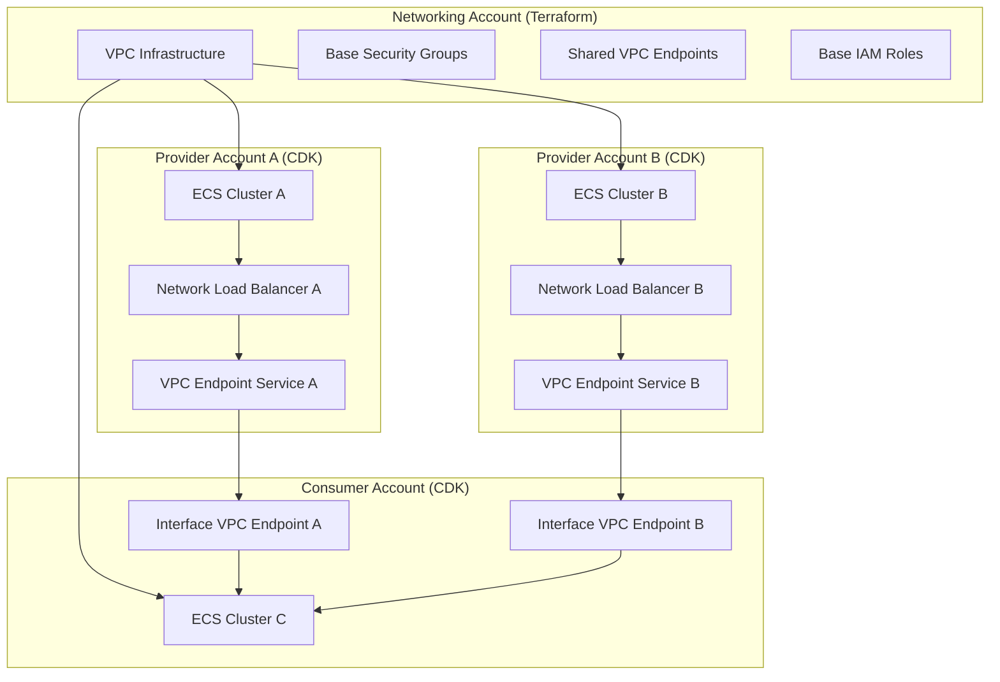

# Multi-Account Microservices with AWS ECS, PrivateLink, Terraform, and CDK

A comprehensive solution for implementing secure, scalable multi-account microservices architecture using AWS ECS, PrivateLink, Terraform, and AWS CDK (TypeScript). This project enables bidirectional intercommunication among microservices across different AWS accounts with clear separation of concerns and enhanced security governance.

---

## Table of Contents

- [Overview](#overview)
- [Architecture](#architecture)
- [Project Structure](#project-structure)
- [Prerequisites](#prerequisites)
- [Quick Start](#quick-start)
- [Deployment Guide](#deployment-guide)
- [Configuration](#configuration)
- [Security Considerations](#security-considerations)
- [Monitoring and Observability](#monitoring-and-observability)
- [Troubleshooting](#troubleshooting)
- [Best Practices](#best-practices)
- [Advanced Configuration](#advanced-configuration)
- [Local Development](#local-development)
- [Resources](#resources)

---

## Overview

This project implements a **hybrid infrastructure-as-code approach** that combines the strengths of Terraform and AWS CDK to create a secure, scalable multi-account microservices architecture:

### **Terraform Account (Networking Infrastructure)**
- **Core VPC Infrastructure**: VPC, subnets, gateways, routing tables
- **Governance Resources**: Base security groups, shared VPC endpoints, base IAM roles
- **Centralized Logging**: CloudWatch log groups with consistent retention policies
- **Network Monitoring**: VPC Flow Logs for security analysis
- **Cross-Account Policies**: Resource sharing and access control

### **Provider Accounts (Service Providers)**
- **ECS Infrastructure**: Fargate clusters, services, task definitions
- **Service Exposure**: Network Load Balancers and VPC Endpoint Services
- **Application Security**: Service-specific security groups extending base policies
- **Cross-Account Sharing**: Secure service exposure to other accounts

### **Consumer Accounts (Service Consumers)**
- **Service Consumption**: Interface VPC endpoints for consuming external services
- **Application Infrastructure**: ECS clusters for consumer microservices
- **Connectivity Management**: Cross-account service discovery and connection
- **Security Integration**: Consumer-specific security groups

---

## Architecture

### Account Structure

```
Organization Root Account
├── Security Account (Audit, Logging, Security Tools)
├── Networking Account (Shared VPC, Transit Gateway, DNS) ← Terraform
├── Shared Services Account (CI/CD, Monitoring, Artifacts)
└── Microservices Accounts
    ├── Provider Account 1 (user-service) ← CDK Provider
    ├── Provider Account 2 (notification-service) ← CDK Provider
    ├── Consumer Account 1 (api-gateway) ← CDK Consumer
    └── Consumer Account 2 (analytics-service) ← CDK Consumer
```

### Resource Separation

#### **Terraform (Stable Resources)**
- **Core Networking**: VPC, subnets, gateways, routing tables
- **Base Security Groups**: Centralized security policies and governance
- **Shared VPC Endpoints**: Common AWS services (S3, DynamoDB, ECR, CloudWatch)
- **Base IAM Roles**: Security compliance and access management
- **Centralized Logging**: Consistent retention policies and monitoring
- **Network Monitoring**: VPC Flow Logs and security analysis

#### **CDK Provider (Dynamic Resources)**
- **ECS Infrastructure**: Clusters, services, task definitions
- **Application Load Balancers**: Service-specific traffic distribution
- **VPC Endpoint Services**: Service exposure and cross-account sharing
- **Application Security Rules**: Service-specific ingress/egress
- **Service Configuration**: Application-specific settings and environment

#### **CDK Consumer (Dynamic Resources)**
- **Interface VPC Endpoints**: Service consumption from other accounts
- **Consumer ECS Infrastructure**: Clusters for consumer microservices
- **Service Discovery**: Cross-account service connectivity
- **Consumer Security Groups**: Application-specific security rules

### Bidirectional Communication



---

## Project Structure

```
aws-ecs-privatelink-terraform-cdk/
├── terraform-base-infra/          # 🌐 Terraform Account (Networking)
│   ├── main.tf                   # VPC, subnets, security groups, VPC endpoints, IAM roles, logs
│   ├── variables.tf
│   ├── outputs.tf
│   └── provider.tf
├── cdk-provider-account/          # 🔧 Provider Account (Service Providers)
│   ├── bin/
│   │   └── app.ts                 # CDK app entry point for provider stack
│   ├── lib/
│   │   └── microservices-stack.ts # ECS cluster, NLBs, VPC Endpoint Services
│   ├── package.json
│   ├── tsconfig.json
│   └── README.md
├── cdk-consumer-account/          # 🔌 Consumer Account (Service Consumers)
│   ├── bin/
│   │   └── app.ts                 # CDK app entry point for consumer stack
│   ├── lib/
│   │   └── connectivity-stack.ts  # Interface VPC endpoints for consuming services
│   ├── package.json
│   ├── tsconfig.json
│   └── README.md
├── scripts/                       # 🚀 Deployment Scripts
│   ├── deploy-terraform-account.sh    # Deploy networking infrastructure
│   ├── deploy-provider-account.sh     # Deploy service providers
│   ├── deploy-consumer-account.sh     # Deploy service consumers
│   └── deploy-all-accounts.sh         # Master orchestration script
├── microservice/                  # 🧪 Local Testing
│   ├── Dockerfile
│   ├── app/                       # FastAPI application with health endpoints
│   └── README.md
└── README.md                      # This comprehensive guide
```

---

## Prerequisites

### Required Tools
- **Terraform 1.13+** - [Installation Guide](https://learn.hashicorp.com/tutorials/terraform/install-cli)
- **Node.js 22+** - [Download](https://nodejs.org/)
- **AWS CLI** - [Installation Guide](https://docs.aws.amazon.com/cli/latest/userguide/getting-started-install.html)
- **AWS CDK CLI** - Run: `npm install -g aws-cdk`

### AWS Account Setup
1. **Networking Account** - For shared VPC and networking infrastructure
2. **Provider Accounts** - For microservices that provide services (2+ accounts recommended)
3. **Consumer Accounts** - For microservices that consume services (2+ accounts recommended)

### AWS Configuration
1. Configure AWS CLI with appropriate credentials:
   ```bash
   aws configure
   ```

2. Set up AWS profiles for different accounts:
   ```bash
   aws configure --profile networking-account
   aws configure --profile provider-account-1
   aws configure --profile consumer-account-1
   ```

3. Bootstrap CDK in your AWS accounts:
   ```bash
   cdk bootstrap aws://ACCOUNT-NUMBER/REGION
   ```

---

## Quick Start

### Option 1: Master Orchestration (Recommended)

Use the master orchestration script to deploy all three account types:

```bash
# Deploy with defaults
./scripts/deploy-all-accounts.sh

# Deploy with custom configuration
./scripts/deploy-all-accounts.sh dev us-east-1 111111111111 222222222222,333333333333 444444444444,555555555555
```

### Option 2: Individual Account Deployment

#### Step 1: Deploy Terraform Account (Networking Infrastructure)

```bash
./scripts/deploy-terraform-account.sh dev us-east-1 111111111111 222222222222,333333333333,444444444444
```

#### Step 2: Deploy Provider Accounts (Service Providers)

```bash
# Deploy to provider account 1
./scripts/deploy-provider-account.sh dev us-east-1 222222222222 api-service 8080 nginx:alpine

# Deploy to provider account 2
./scripts/deploy-provider-account.sh dev us-east-1 333333333333 user-service 3000 nginx:alpine
```

#### Step 3: Deploy Consumer Accounts (Service Consumers)

```bash
# Deploy to consumer account 1
./scripts/deploy-consumer-account.sh dev us-east-1 444444444444 api-consumer 80 nginx:alpine

# Deploy to consumer account 2
./scripts/deploy-consumer-account.sh dev us-east-1 555555555555 user-consumer 80 nginx:alpine
```

---

## Deployment Guide

### Option 1: Master Orchestration (Recommended)

The master orchestration script provides a comprehensive deployment solution:

```bash
# Deploy all accounts with defaults
./scripts/deploy-all-accounts.sh

# Deploy with custom configuration
./scripts/deploy-all-accounts.sh dev us-east-1 111111111111 222222222222,333333333333 444444444444,555555555555
```

**Features:**
- Automated account validation
- Prerequisites checking
- Error handling and rollback
- Progress tracking
- Output verification

### Option 2: Individual Account Deployment

#### Terraform Account Deployment

```bash
# Deploy networking infrastructure
./scripts/deploy-terraform-account.sh dev us-east-1 111111111111 222222222222,333333333333,444444444444
```

**What it deploys:**
- VPC with public, private, and isolated subnets
- Internet Gateway and NAT Gateways
- Base security groups for centralized governance
- Shared VPC endpoints (S3, DynamoDB, ECR, CloudWatch)
- Base IAM roles for ECS tasks
- Centralized CloudWatch log groups
- VPC Flow Logs for network monitoring

#### Provider Account Deployment

```bash
# Deploy service provider
./scripts/deploy-provider-account.sh dev us-east-1 222222222222 api-service 8080 nginx:alpine
```

**What it deploys:**
- ECS Fargate cluster
- Microservice task definition and service
- Network Load Balancer
- VPC Endpoint Service for cross-account sharing
- Application-specific security groups
- Cross-account resource policies

#### Consumer Account Deployment

```bash
# Deploy service consumer
./scripts/deploy-consumer-account.sh dev us-east-1 444444444444 api-consumer 80 nginx:alpine
```

**What it deploys:**
- ECS Fargate cluster for consumer
- Interface VPC endpoints for consuming external services
- Consumer-specific security groups
- Service discovery configuration

### Manual Deployment (Advanced)

If you prefer manual deployment, follow these steps:

#### Step 1: Deploy Base Networking (Terraform)

1. Navigate to the Terraform directory:
   ```bash
   cd terraform-base-infra
   ```

2. Create terraform.tfvars:
   ```hcl
   aws_region = "us-east-1"
   account_id = "111111111111"
   environment = "dev"
   
   microservices_accounts = [
     "222222222222",
     "333333333333",
     "444444444444"
   ]
   
   vpc_cidr = "10.0.0.0/16"
   public_subnet_cidrs = ["10.0.1.0/24", "10.0.2.0/24"]
   private_subnet_cidrs = ["10.0.3.0/24", "10.0.4.0/24"]
   isolated_subnet_cidrs = ["10.0.5.0/28", "10.0.6.0/28"]
   
   cross_account_external_id = "multi-account-dev-$(date +%s)"
   ```

3. Deploy:
   ```bash
   terraform init
   terraform apply -var-file="terraform.tfvars"
   ```

4. Export outputs for CDK:
   ```bash
   export VPC_ID=$(terraform output -raw vpc_id)
   export PUBLIC_SUBNETS=$(terraform output -json public_subnet_ids)
   export PRIVATE_SUBNETS=$(terraform output -json private_subnet_ids)
   export BASE_DEFAULT_SECURITY_GROUP_ID=$(terraform output -raw base_default_security_group_id)
   export BASE_PRIVATE_SECURITY_GROUP_ID=$(terraform output -raw base_private_security_group_id)
   export ECS_TASK_EXECUTION_ROLE_ARN=$(terraform output -raw ecs_task_execution_role_arn)
   export ECS_TASK_ROLE_ARN=$(terraform output -raw ecs_task_role_arn)
   export ECS_APPLICATION_LOG_GROUP_NAME=$(terraform output -raw ecs_application_log_group_name)
   ```

#### Step 2: Deploy Provider Account (CDK)

1. Navigate to the provider CDK directory:
   ```bash
   cd cdk-provider-account
   ```

2. Install dependencies:
   ```bash
   npm install
   ```

3. Deploy the provider stack:
   ```bash
   cdk deploy api-service-provider-stack \
     --context environment=dev \
     --context accountId=222222222222 \
     --context vpcId=$VPC_ID \
     --context publicSubnetIds="$PUBLIC_SUBNETS" \
     --context privateSubnetIds="$PRIVATE_SUBNETS" \
     --context baseDefaultSecurityGroupId="$BASE_DEFAULT_SECURITY_GROUP_ID" \
     --context basePrivateSecurityGroupId="$BASE_PRIVATE_SECURITY_GROUP_ID" \
     --context ecsTaskExecutionRoleArn="$ECS_TASK_EXECUTION_ROLE_ARN" \
     --context ecsTaskRoleArn="$ECS_TASK_ROLE_ARN" \
     --context ecsApplicationLogGroupName="$ECS_APPLICATION_LOG_GROUP_NAME" \
     --context microserviceName=api-service \
     --context microservicePort=8080 \
     --context microserviceImage=nginx:alpine
   ```

#### Step 3: Deploy Consumer Account (CDK)

1. Navigate to the consumer CDK directory:
   ```bash
   cd cdk-consumer-account
   ```

2. Install dependencies:
   ```bash
   npm install
   ```

3. Deploy the consumer stack:
   ```bash
   cdk deploy api-consumer-stack \
     --context environment=dev \
     --context accountId=444444444444 \
     --context vpcId=$VPC_ID \
     --context privateSubnetIds="$PRIVATE_SUBNETS" \
     --context basePrivateSecurityGroupId="$BASE_PRIVATE_SECURITY_GROUP_ID" \
     --context ecsTaskExecutionRoleArn="$ECS_TASK_EXECUTION_ROLE_ARN" \
     --context ecsTaskRoleArn="$ECS_TASK_ROLE_ARN" \
     --context ecsApplicationLogGroupName="$ECS_APPLICATION_LOG_GROUP_NAME" \
     --context microserviceName=api-consumer \
     --context microservicePort=80 \
     --context microserviceImage=nginx:alpine \
     --context consumerEndpointServices='[{"serviceName":"api-service","vpcEndpointServiceId":"vpce-svc-1234567890abcdef0","port":8080}]'
   ```

---

## Configuration

### Environment-Specific Settings

#### Development Environment
```bash
minCapacity: 1
maxCapacity: 3
instanceType: t3.micro
allowedAccounts: ["111111111111", "222222222222"]
```

#### Staging Environment
```bash
minCapacity: 2
maxCapacity: 5
instanceType: t3.small
allowedAccounts: ["111111111111", "222222222222", "333333333333"]
```

#### Production Environment
```bash
minCapacity: 3
maxCapacity: 10
instanceType: t3.medium
allowedAccounts: ["111111111111", "222222222222", "333333333333", "444444444444"]
```

### CDK Context Variables

#### Provider Account
- `vpcId` - VPC ID from Terraform outputs
- `publicSubnetIds` - JSON array of public subnet IDs
- `privateSubnetIds` - JSON array of private subnet IDs
- `baseDefaultSecurityGroupId` - Base default security group ID
- `basePrivateSecurityGroupId` - Base private security group ID
- `ecsTaskExecutionRoleArn` - ECS task execution role ARN
- `ecsTaskRoleArn` - ECS task role ARN
- `ecsApplicationLogGroupName` - CloudWatch log group name
- `microserviceName` - Name of the microservice
- `microservicePort` - Port the microservice runs on
- `microserviceImage` - Docker image for the microservice
- `allowedAccounts` - Array of allowed account IDs for cross-account access

#### Consumer Account
- `vpcId` - VPC ID from Terraform outputs
- `privateSubnetIds` - JSON array of private subnet IDs
- `basePrivateSecurityGroupId` - Base private security group ID
- `ecsTaskExecutionRoleArn` - ECS task execution role ARN
- `ecsTaskRoleArn` - ECS task role ARN
- `ecsApplicationLogGroupName` - CloudWatch log group name
- `microserviceName` - Name of the consumer microservice
- `microservicePort` - Port the microservice runs on
- `microserviceImage` - Docker image for the microservice
- `consumerEndpointServices` - Array of endpoint services to consume

### Example Configuration Files

#### terraform.tfvars
```hcl
aws_region = "us-east-1"
account_id = "111111111111"
environment = "prod"

microservices_accounts = [
  "222222222222",
  "333333333333",
  "444444444444"
]

vpc_cidr = "10.0.0.0/16"
public_subnet_cidrs = ["10.0.1.0/24", "10.0.2.0/24"]
private_subnet_cidrs = ["10.0.3.0/24", "10.0.4.0/24"]
isolated_subnet_cidrs = ["10.0.5.0/28", "10.0.6.0/28"]

cross_account_external_id = "multi-account-prod-$(date +%s)"
```

#### config.example.json
```json
{
  "microservices": [
    {
      "name": "user-service",
      "port": 8080,
      "image": "your-registry/user-service:latest",
      "consumerEndpointServices": [
        {
          "serviceName": "notification-service",
          "vpcEndpointServiceId": "com.amazonaws.vpce.us-east-1.vpce-svc-12345678",
          "port": 8081
        }
      ]
    }
  ],
  "networking": {
    "vpcCidr": "10.0.0.0/16",
    "publicSubnetCidrs": ["10.0.1.0/24", "10.0.2.0/24"],
    "privateSubnetCidrs": ["10.0.3.0/24", "10.0.4.0/24"]
  },
  "aws": {
    "region": "us-east-1",
    "accounts": {
      "networking": "111111111111",
      "providers": ["222222222222", "333333333333"],
      "consumers": ["444444444444", "555555555555"]
    }
  }
}
```

---

## Security Considerations

### Network Security
- **Private Subnets**: Microservices run in private subnets without direct internet access
- **Security Groups**: Layered security with base and application-specific rules
- **VPC Flow Logs**: Comprehensive network monitoring and security analysis
- **NAT Gateway**: Controlled outbound internet access
- **PrivateLink**: Secure cross-account communication without internet exposure

### Access Control
- **IAM Roles**: Least privilege access for ECS tasks
- **Resource Policies**: Cross-account PrivateLink access control
- **Secrets Management**: AWS Secrets Manager for sensitive configuration
- **Encryption**: Data in transit and at rest
- **External IDs**: Secure cross-account role assumption

### Compliance
- **Account Isolation**: Clear boundaries between different environments
- **Audit Logging**: CloudTrail for all API calls
- **Monitoring**: CloudWatch for operational visibility
- **Resource Tagging**: Consistent tagging strategy for cost allocation and governance

### Cross-Account Security

#### IAM Best Practices
```typescript
// CDK: Minimal permissions for ECS tasks
const taskRole = new iam.Role(this, 'TaskRole', {
  assumedBy: new iam.ServicePrincipal('ecs-tasks.amazonaws.com'),
  inlinePolicies: {
    S3Access: new iam.PolicyDocument({
      statements: [
        new iam.PolicyStatement({
          effect: iam.Effect.ALLOW,
          actions: ['s3:GetObject'],
          resources: [`arn:aws:s3:::${bucketName}/*`]
        })
      ]
    })
  }
});
```

#### Cross-Account Resource Policies
```hcl
# Terraform: Restrict VPC endpoint service access
resource "aws_vpc_endpoint_service" "example" {
  vpc_endpoint_service_load_balancers = [aws_lb.example.arn]
  acceptance_required                 = true
  
  allowed_principals = [
    "arn:aws:iam::222222222222:root",
    "arn:aws:iam::333333333333:root"
  ]
}
```

---

## Monitoring and Observability

### Centralized Logging
```typescript
// CDK: Centralized CloudWatch logs
const logGroup = new logs.LogGroup(this, 'LogGroup', {
  logGroupName: `/aws/ecs/${serviceName}`,
  retention: logs.RetentionDays.ONE_MONTH,
  removalPolicy: cdk.RemovalPolicy.DESTROY
});

// Cross-account log sharing
const logGroupPolicy = new logs.ResourcePolicy(this, 'LogGroupPolicy', {
  resourcePolicy: {
    statements: [
      new iam.PolicyStatement({
        effect: iam.Effect.ALLOW,
        principals: [new iam.AccountPrincipal('111111111111')],
        actions: ['logs:CreateLogStream', 'logs:PutLogEvents'],
        resources: [logGroup.logGroupArn]
      })
    ]
  }
});
```

### CloudWatch Integration
- **Container Insights**: Detailed ECS performance metrics
- **Custom Logs**: Application-specific logging
- **Alarms**: Proactive issue detection
- **Dashboards**: Real-time operational visibility

### Distributed Tracing
- **AWS X-Ray**: End-to-end request tracing
- **Service Maps**: Visual representation of service dependencies
- **Performance Analysis**: Bottleneck identification

### Cost Management
```typescript
// CDK: Consistent tagging
const tags = {
  Project: 'Multi-Account-Microservices',
  Environment: environment,
  Service: serviceName,
  Team: 'Platform',
  CostCenter: 'Engineering',
  ManagedBy: 'CDK'
};

// Apply tags to all resources
cdk.Tags.of(this).add('Project', tags.Project);
cdk.Tags.of(this).add('Environment', tags.Environment);
cdk.Tags.of(this).add('Service', tags.Service);
```

---

## Troubleshooting

### Common Issues

#### 1. Cross-Account Access Denied
```bash
# Check IAM roles and policies
aws sts get-caller-identity --profile provider-account-1
aws iam get-role --role-name CrossAccountRole-prod --profile networking-account
```

#### 2. VPC Endpoint Service Not Accessible
```bash
# Verify VPC endpoint service status
aws ec2 describe-vpc-endpoint-services --service-names com.amazonaws.vpce.us-east-1.vpce-svc-12345678
```

#### 3. CDK Bootstrap Issues
```bash
# Re-bootstrap if needed
cdk bootstrap aws://ACCOUNT-ID/REGION --profile PROFILE-NAME --force
```

#### 4. Terraform State Issues
```bash
# Check state and reinitialize if needed
terraform state list
terraform init -reconfigure
```

### Debugging Commands

#### Network Connectivity
```bash
# Test VPC endpoint connectivity
curl -v http://vpce-12345678-abcdefgh.vpce-svc-12345678.us-east-1.vpce.amazonaws.com/health
```

#### Service Health
```bash
# Check ECS service health
aws ecs describe-services --cluster user-service-cluster --services user-service-service
```

#### Cross-Account Resources
```bash
# List shared resources
aws ram get-resource-shares --profile networking-account
```

### Useful Commands

```bash
# List all CDK stacks
cdk list

# View CDK diff
cdk diff

# Destroy CDK stack
cdk destroy

# View Terraform state
terraform show

# Destroy Terraform infrastructure
terraform destroy
```

---

## Best Practices

### Infrastructure as Code
- **Version Control**: All infrastructure code in Git
- **Code Reviews**: Peer review for all changes
- **Testing**: Automated testing of infrastructure changes
- **Documentation**: Comprehensive documentation and examples

### Operational Excellence
- **Automated Deployments**: CI/CD pipelines for infrastructure
- **Rollback Strategies**: Quick recovery from failed deployments
- **Monitoring**: Proactive monitoring and alerting
- **Disaster Recovery**: Multi-region deployment capabilities

### Security
- **Least Privilege**: Minimal required permissions
- **Regular Audits**: Periodic security reviews
- **Secret Rotation**: Automated credential rotation
- **Network Segmentation**: Proper network isolation

### Development
- **Environment-Specific Configuration**: Use context for different environments
- **Error Handling**: Implement proper error handling and validation
- **CDK Constructs**: Use CDK constructs for complex patterns
- **Regular Updates**: Keep dependencies up to date

---

## Advanced Configuration

### Multi-Region Deployment
```typescript
// CDK: Multi-region deployment
const regions = ['us-east-1', 'us-west-2', 'eu-west-1'];

regions.forEach(region => {
  new MicroservicesStack(app, `${serviceName}-${region}`, {
    env: { account: accountId, region },
    // ... other props
  });
});
```

### Custom VPC Endpoint Services
```typescript
// CDK: Create custom VPC endpoint service
const customService = new ec2.VpcEndpointService(this, 'CustomService', {
  vpcEndpointServiceLoadBalancers: [customNLB],
  acceptanceRequired: true,
  allowedPrincipals: allowedAccounts.map(accountId => 
    new iam.ArnPrincipal(`arn:aws:iam::${accountId}:root`)
  ),
});
```

### Custom Resource Sharing
```hcl
# Terraform: Share additional resources
resource "aws_ram_resource_association" "custom_resource" {
  resource_arn       = aws_custom_resource.example.arn
  resource_share_arn = aws_ram_resource_share.vpc_share.arn
}
```

---

## Local Development

### Local Microservice for Testing

The project includes a FastAPI microservice for local testing of VPC endpoint connectivity:

#### Prerequisites
- Python 3.11+
- Docker
- (Optional) Virtual environment tool such as `venv` or `virtualenv`

#### Install Dependencies
```bash
cd microservice
python -m venv venv
source venv/bin/activate # On Windows: venv\Scripts\activate
pip install -r requirements.txt
```

#### Run Locally
```bash
uvicorn app.main:app --reload --host 0.0.0.0 --port 8000
```

Visit [http://localhost:8000](http://localhost:8000) to test the service.

#### API Endpoints
- `GET /` - Returns a welcome message
- `GET /hello` - Returns a simple greeting message
- `GET /health` - Health check endpoint for load balancer health checks

#### Docker Support
```bash
# Build the Docker image
docker build -t ecs-python-microservice .

# Run the container locally
docker run -p 8000:8000 ecs-python-microservice
```

#### Testing VPC Endpoint Connectivity
1. Deploy CDK Stack First - Ensure the CDK stack is deployed and note the VPC Endpoint Service DNS name
2. Run Local Microservice - Start the local microservice
3. Test Connectivity - From within the VPC, test connectivity to the CDK-deployed microservice:
   ```bash
   # Test health endpoint
   curl http://<vpc-endpoint-dns-name>/health
   
   # Test basic connectivity
   curl http://<vpc-endpoint-dns-name>/
   
   # Test from local microservice
   curl http://<vpc-endpoint-dns-name>/hello
   ```

---

## Resources

### Documentation
- [AWS Multi-Account Strategy Whitepaper](https://docs.aws.amazon.com/whitepapers/latest/organizing-your-aws-environment/)
- [AWS VPC Endpoint Services Documentation](https://docs.aws.amazon.com/vpc/latest/privatelink/vpc-endpoints.html)
- [Terraform AWS Provider Documentation](https://registry.terraform.io/providers/hashicorp/aws/latest/docs)
- [AWS CDK Developer Guide](https://docs.aws.amazon.com/cdk/latest/guide/home.html)

### Community
- [Terraform Community](https://discuss.hashicorp.com/c/terraform-core)
- [AWS CDK GitHub](https://github.com/aws/aws-cdk)
- [AWS Community Forums](https://repost.aws/)

### Related Projects
- [AWS ECS Documentation](https://docs.aws.amazon.com/AmazonECS/latest/developerguide/Welcome.html)
- [FastAPI Documentation](https://fastapi.tiangolo.com/)
- [Uvicorn ASGI Server](https://www.uvicorn.org/)

---

## License

MIT License

---

*This comprehensive guide provides everything you need to implement and manage a secure, scalable multi-account microservices architecture using Terraform and AWS CDK. The complete source code and deployment scripts are available in this repository.*
