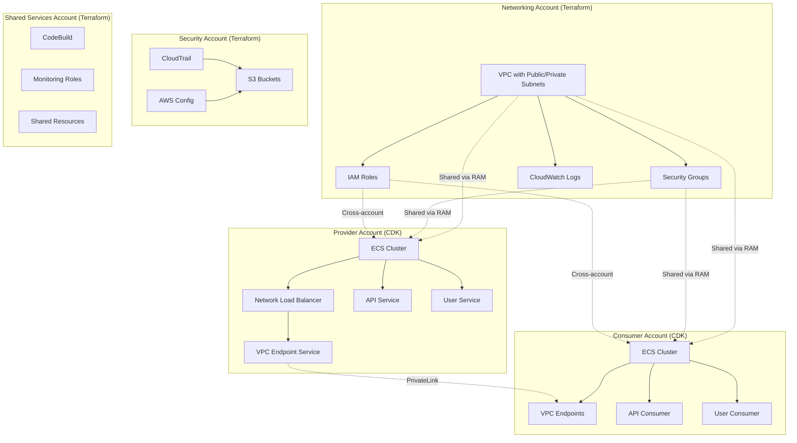

# Multi-Account Microservices with AWS ECS, PrivateLink, Terraform, and CDK

A secure, scalable multi-account microservices architecture using AWS ECS, PrivateLink, Terraform, and AWS CDK (TypeScript).

## Table of Contents

- [Architecture](#architecture)
- [Project Structure](#project-structure)
- [Prerequisites](#prerequisites)
- [Quick Start](#quick-start)
- [Deployment](#deployment)
- [Configuration](#configuration)

## Architecture



### **Terraform (Networking Infrastructure)**
- **Base Infrastructure**: VPC, subnets, security groups, IAM roles, CloudWatch logs
- **Security Account**: CloudTrail, Config, S3 buckets, cross-account policies
- **Shared Services**: CodeBuild, monitoring roles, shared resources

### **CDK (Application Infrastructure)**
- **Provider Accounts**: ECS clusters, services, Network Load Balancers, VPC Endpoint Services
- **Consumer Accounts**: ECS clusters, Interface VPC endpoints for consuming external services

## Project Structure

```
├── terraform-base-infra/          # Core VPC and networking infrastructure
├── terraform-security-account/    # Security and compliance resources
├── terraform-shared-services-account/ # Shared services and CI/CD
├── cdk-provider-account/          # Service provider infrastructure
├── cdk-consumer-account/          # Service consumer infrastructure
└── microservice-repo/             # Sample FastAPI microservice
```

## Prerequisites

- **Terraform** (v1.0+)
- **Node.js** (v18+)
- **AWS CDK CLI** (`npm install -g aws-cdk`)
- **AWS CLI** configured with appropriate credentials
- **Docker** (for microservice development)

## Quick Start

### 1. Local Testing

```bash
# Test different environments
cd terraform-base-infra
terraform workspace select dev && terraform plan
terraform workspace select staging && terraform plan
terraform workspace select prod && terraform plan

# Test CDK synthesis
cd ../cdk-provider-account
npx cdk synth
cd ../cdk-consumer-account
npx cdk synth
```

### 2. Deploy Infrastructure

```bash
# Deploy Terraform infrastructure
cd terraform-base-infra
terraform workspace select dev
terraform apply

cd ../terraform-security-account
terraform workspace select dev
terraform apply

cd ../terraform-shared-services-account
terraform workspace select dev
terraform apply

# Deploy CDK applications
cd ../cdk-provider-account
npx cdk deploy --all

cd ../cdk-consumer-account
npx cdk deploy --all
```

## Deployment

### Terraform Backend Configuration

For production, configure S3 backend with DynamoDB locking:

```bash
# Create S3 bucket and DynamoDB table
aws s3 mb s3://your-terraform-state-bucket
aws dynamodb create-table --table-name terraform-locks --attribute-definitions AttributeName=LockID,AttributeType=S --key-schema AttributeName=LockID,KeyType=HASH --provisioned-throughput ReadCapacityUnits=5,WriteCapacityUnits=5
```

Update `provider.tf` in each Terraform directory:

```hcl
terraform {
  backend "s3" {
    bucket         = "your-terraform-state-bucket"
    key            = "terraform.tfstate"
    region         = "us-east-1"
    dynamodb_table = "terraform-locks"
    encrypt        = true
  }
}
```

### Deployment Order

1. **Base Infrastructure** (`terraform-base-infra`)
2. **Security Account** (`terraform-security-account`)
3. **Shared Services** (`terraform-shared-services-account`)
4. **Provider CDK** (`cdk-provider-account`)
5. **Consumer CDK** (`cdk-consumer-account`)

## Configuration

### Terraform Configuration

Each Terraform module uses `locals` blocks for configuration:

```hcl
locals {
  environment = terraform.workspace
  account_id  = "111111111111"
  
  environment_config = {
    dev = {
      memory_limit_mib = 512
      cpu              = 256
      desired_count    = 1
    }
    staging = {
      memory_limit_mib = 1024
      cpu              = 512
      desired_count    = 2
    }
    prod = {
      memory_limit_mib = 2048
      cpu              = 1024
      desired_count    = 3
    }
  }
}
```

### CDK Configuration

CDK applications use hardcoded constants in `lib/*-stack.ts`:

```typescript
const CONFIG = {
  PROVIDER_ACCOUNT_ID: '222222222222',
  CONSUMER_ACCOUNT_ID: '333333333333',
  REGION: 'us-east-1',
  
  API_SERVICE: {
    name: 'api-service',
    port: 8080,
    image: 'nginx:alpine'
  }
} as const;
```

### Environment Variables

For production deployment, update account IDs and region in the configuration files.

## Microservice Development

The `microservice-repo/` contains a sample FastAPI application:

```bash
cd microservice-repo
python -m venv venv
source venv/bin/activate
pip install -r requirements.txt
uvicorn app.main:app --reload --host 0.0.0.0 --port 8000
```

## Security Considerations

- **Network Isolation**: Services communicate through VPC endpoints only
- **IAM Roles**: Least privilege access with cross-account role assumptions
- **Encryption**: All data encrypted in transit and at rest
- **Monitoring**: CloudTrail, Config, and CloudWatch for comprehensive logging

## Resources

- [AWS ECS Documentation](https://docs.aws.amazon.com/ecs/)
- [AWS PrivateLink Documentation](https://docs.aws.amazon.com/vpc/latest/privatelink/)
- [Terraform AWS Provider](https://registry.terraform.io/providers/hashicorp/aws/latest)
- [AWS CDK Documentation](https://docs.aws.amazon.com/cdk/)