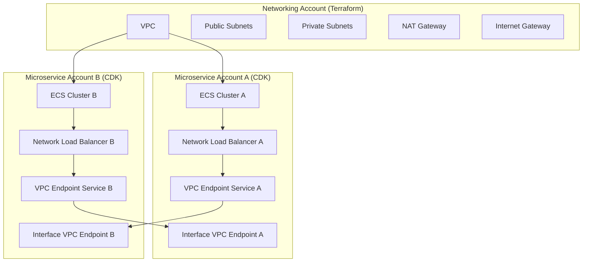

# Building Secure Multi-Account Microservices with AWS ECS, PrivateLink, Terraform, and CDK

*A comprehensive guide to implementing bidirectional microservice communication across AWS accounts using modern infrastructure-as-code practices*

---

## Introduction

In today's cloud-native landscape, organizations are increasingly adopting multi-account strategies to improve security, compliance, and operational isolation. However, enabling secure communication between microservices across different AWS accounts presents unique challenges. This blog post explores a robust solution that combines **Terraform** for foundational networking with **AWS CDK (TypeScript)** for microservices infrastructure, creating a secure, scalable architecture using **AWS PrivateLink** for cross-account communication.

## The Challenge: Multi-Account Microservice Communication

Traditional microservice architectures often struggle with:

- **Security concerns** when services need to communicate across account boundaries
- **Network complexity** in multi-account environments
- **Operational overhead** of managing different infrastructure tools
- **Compliance requirements** for data isolation and access control

Our solution addresses these challenges by implementing a hybrid approach that leverages the strengths of both Terraform and AWS CDK while maintaining clear separation of concerns.

## Architecture Overview

### High-Level Design

The architecture consists of two main components:

1. **Networking Account** - Managed by Terraform
   - Core VPC infrastructure
   - Subnets (public, private, isolated)
   - NAT Gateways and Internet Gateway
   - Route tables and security groups

2. **Microservices Accounts** - Managed by AWS CDK
   - ECS Fargate clusters
   - Microservice deployments
   - Network Load Balancers (NLBs)
   - VPC Endpoint Services (providers)
   - Interface VPC Endpoints (consumers)

### Key Components



## Technical Implementation

### 1. Terraform Base Infrastructure

The Terraform configuration creates the foundational network infrastructure:

```hcl
# VPC with DNS support
resource "aws_vpc" "base" {
  cidr_block           = var.vpc_cidr
  enable_dns_hostnames = true
  enable_dns_support   = true
  tags = {
    Name = "base-vpc"
  }
}

# Multi-AZ subnets for high availability
resource "aws_subnet" "public" {
  count                   = length(var.public_subnet_cidrs)
  cidr_block              = var.public_subnet_cidrs[count.index]
  map_public_ip_on_launch = true
  availability_zone       = element(data.aws_availability_zones.available.names, count.index)
  vpc_id                  = aws_vpc.base.id
  tags = {
    Name = "public-subnet-${count.index + 1}"
  }
}

# NAT Gateway for private subnet internet access
resource "aws_nat_gateway" "nat" {
  count         = length(aws_subnet.public)
  allocation_id = aws_eip.nat[count.index].id
  subnet_id     = aws_subnet.public[count.index].id
  tags = {
    Name = "nat-gateway-${count.index + 1}"
  }
}
```

### 2. CDK Microservices Stack

The CDK stack handles microservice deployment and PrivateLink configuration:

```typescript
export class MicroservicesStack extends cdk.Stack {
  public readonly vpc: ec2.IVpc;
  public readonly cluster: ecs.Cluster;
  public readonly nlb: elbv2.NetworkLoadBalancer;
  public readonly vpcEndpointService: ec2.VpcEndpointService;

  constructor(scope: Construct, id: string, props: MicroservicesStackProps) {
    super(scope, id, props);

    // Import VPC from Terraform outputs
    this.vpc = ec2.Vpc.fromLookup(this, 'ImportedVpc', {
      vpcId: props.vpcId,
    });

    // Create ECS Cluster with container insights
    this.cluster = new ecs.Cluster(this, 'MicroserviceCluster', {
      vpc: this.vpc,
      clusterName: `${props.microserviceName}-cluster`,
      containerInsights: true,
    });

    // Create VPC Endpoint Service for exposing microservice
    this.vpcEndpointService = new ec2.VpcEndpointService(this, 'MicroserviceVpcEndpointService', {
      vpcEndpointServiceLoadBalancers: [this.nlb],
      acceptanceRequired: false,
      allowedPrincipals: [
        new iam.ArnPrincipal('*'), // Restrict in production
      ],
    });
  }
}
```

### 3. Bidirectional Communication Setup

The architecture enables bidirectional communication through:

**Provider Side (Exposing Services):**
- ECS Fargate service running the microservice
- Network Load Balancer for traffic distribution
- VPC Endpoint Service for PrivateLink exposure

**Consumer Side (Consuming Services):**
- Interface VPC Endpoints to connect to other services
- Security groups for traffic control
- Cross-account resource policies

## Why Hybrid Terraform + CDK?

### Terraform Advantages
- **Stability**: Mature tool for networking infrastructure
- **State Management**: Excellent for shared, long-lived resources
- **Provider Ecosystem**: Comprehensive AWS resource coverage
- **Team Familiarity**: Widely adopted in enterprise environments

### CDK Advantages
- **Type Safety**: Compile-time error checking with TypeScript
- **Rich Constructs**: High-level abstractions for complex patterns
- **Flexibility**: Easy to model dynamic, application-specific infrastructure
- **Developer Experience**: Familiar programming language and IDE support

### Clear Separation of Concerns
- **Terraform**: Manages shared, stable networking foundation
- **CDK**: Handles dynamic, application-specific microservice infrastructure
- **Independent Lifecycles**: Changes to one don't affect the other

## Deployment Workflow

### Step 1: Deploy Base Networking (Terraform)

```bash
cd terraform-base-infra
terraform init
terraform apply -auto-approve

# Export outputs for CDK
export VPC_ID=$(terraform output -raw vpc_id)
export PUBLIC_SUBNETS=$(terraform output -json public_subnet_ids)
export PRIVATE_SUBNETS=$(terraform output -json private_subnet_ids)
```

### Step 2: Deploy Microservices (CDK)

```bash
cd cdk-microservices
npm install
cdk deploy -c vpcId=$VPC_ID \
           -c publicSubnetIds="$PUBLIC_SUBNETS" \
           -c privateSubnetIds="$PRIVATE_SUBNETS"
```

### Automated Deployment

The project includes a comprehensive deployment script:

```bash
# Deploy everything
./deploy.sh

# Deploy only specific components
./deploy.sh terraform  # Only networking
./deploy.sh cdk        # Only microservices
```

## Security Considerations

### Network Security
- **Private Subnets**: Microservices run in private subnets without direct internet access
- **Security Groups**: Granular traffic control between services
- **VPC Flow Logs**: Comprehensive network monitoring
- **NAT Gateway**: Controlled outbound internet access

### Access Control
- **IAM Roles**: Least privilege access for ECS tasks
- **Resource Policies**: Cross-account PrivateLink access control
- **Secrets Management**: AWS Secrets Manager for sensitive configuration
- **Encryption**: Data in transit and at rest

### Compliance
- **Account Isolation**: Clear boundaries between different environments
- **Audit Logging**: CloudTrail for all API calls
- **Monitoring**: CloudWatch for operational visibility

## Testing and Validation

### Local Development
The project includes a FastAPI microservice for local testing:

```python
from fastapi import FastAPI

app = FastAPI()

@app.get("/health")
async def health_check():
    return {"status": "healthy", "service": "microservice"}

@app.get("/")
async def root():
    return {"message": "Welcome to the ECS Python microservice!"}
```

### Connectivity Testing
```bash
# Test VPC endpoint connectivity
curl http://<vpc-endpoint-dns-name>/health

# Verify private communication
curl http://<vpc-endpoint-dns-name>/hello
```

## Configuration Management

### Environment-Specific Configuration
```json
{
  "microservices": [
    {
      "name": "user-service",
      "port": 8080,
      "image": "your-registry/user-service:latest",
      "consumerEndpointServices": [
        {
          "serviceName": "notification-service",
          "vpcEndpointServiceId": "com.amazonaws.vpce.us-east-1.vpce-svc-12345678",
          "port": 8081
        }
      ]
    }
  ],
  "networking": {
    "vpcCidr": "10.0.0.0/16",
    "publicSubnetCidrs": ["10.0.1.0/24", "10.0.2.0/24"],
    "privateSubnetCidrs": ["10.0.3.0/24", "10.0.4.0/24"]
  }
}
```

## Monitoring and Observability

### CloudWatch Integration
- **Container Insights**: Detailed ECS performance metrics
- **Custom Logs**: Application-specific logging
- **Alarms**: Proactive issue detection
- **Dashboards**: Real-time operational visibility

### Distributed Tracing
- **AWS X-Ray**: End-to-end request tracing
- **Service Maps**: Visual representation of service dependencies
- **Performance Analysis**: Bottleneck identification

## Best Practices

### Infrastructure as Code
- **Version Control**: All infrastructure code in Git
- **Code Reviews**: Peer review for all changes
- **Testing**: Automated testing of infrastructure changes
- **Documentation**: Comprehensive documentation and examples

### Operational Excellence
- **Automated Deployments**: CI/CD pipelines for infrastructure
- **Rollback Strategies**: Quick recovery from failed deployments
- **Monitoring**: Proactive monitoring and alerting
- **Disaster Recovery**: Multi-region deployment capabilities

### Security
- **Least Privilege**: Minimal required permissions
- **Regular Audits**: Periodic security reviews
- **Secret Rotation**: Automated credential rotation
- **Network Segmentation**: Proper network isolation

## Cost Optimization

### Resource Right-Sizing
- **ECS Task Definitions**: Appropriate CPU and memory allocation
- **Auto Scaling**: Dynamic scaling based on demand
- **Spot Instances**: Cost-effective compute for non-critical workloads
- **Reserved Capacity**: Long-term cost savings for predictable workloads

### Network Optimization
- **VPC Endpoints**: Reduced data transfer costs
- **NAT Gateway**: Shared NAT gateways across availability zones
- **Data Transfer**: Minimize cross-AZ data transfer

## Troubleshooting Guide

### Common Issues

1. **VPC Endpoint Connection Failures**
   - Verify security group rules
   - Check cross-account resource policies
   - Validate DNS resolution

2. **ECS Service Health Issues**
   - Review CloudWatch logs
   - Check health check configuration
   - Verify container image and port mappings

3. **Network Connectivity Problems**
   - Validate route table configuration
   - Check NAT gateway status
   - Review VPC Flow Logs

### Debugging Commands
```bash
# Check ECS service status
aws ecs describe-services --cluster <cluster-name> --services <service-name>

# Verify VPC endpoint services
aws ec2 describe-vpc-endpoint-services --service-names <service-name>

# Test network connectivity
curl -v http://<endpoint-dns-name>/health
```

## Future Enhancements

### Planned Improvements
- **Service Mesh**: Istio integration for advanced traffic management
- **Multi-Region**: Cross-region deployment capabilities
- **GitOps**: ArgoCD integration for Git-based deployments
- **Advanced Monitoring**: Prometheus and Grafana integration

### Scalability Considerations
- **Auto Scaling**: Horizontal pod autoscaling
- **Load Testing**: Performance validation tools
- **Capacity Planning**: Resource utilization analysis
- **Cost Optimization**: Continuous cost monitoring and optimization

## Conclusion

This hybrid Terraform + CDK approach provides a robust, secure, and scalable solution for multi-account microservice communication. By leveraging the strengths of both tools and maintaining clear separation of concerns, organizations can achieve:

- **Enhanced Security**: Private communication through AWS PrivateLink
- **Operational Efficiency**: Clear tool boundaries and responsibilities
- **Developer Productivity**: Type-safe infrastructure code with excellent IDE support
- **Compliance**: Proper account isolation and audit capabilities

The architecture is production-ready and can be extended to support more complex scenarios as your organization's needs evolve. The combination of Terraform's stability for networking and CDK's flexibility for application infrastructure creates a powerful foundation for modern cloud-native applications.

## Resources

- [AWS Multi-Account Strategy Whitepaper](https://docs.aws.amazon.com/whitepapers/latest/organizing-your-aws-environment/)
- [AWS VPC Endpoint Services Documentation](https://docs.aws.amazon.com/vpc/latest/privatelink/vpc-endpoints.html)
- [Terraform AWS Provider Documentation](https://registry.terraform.io/providers/hashicorp/aws/latest/docs)
- [AWS CDK Developer Guide](https://docs.aws.amazon.com/cdk/latest/guide/home.html)
- [Project Repository](https://github.com/your-org/aws-ecs-privatelink-terraform-cdk)

---

*This blog post demonstrates a real-world implementation of secure multi-account microservice communication using modern infrastructure-as-code practices. The complete source code and deployment scripts are available in the accompanying repository.*
